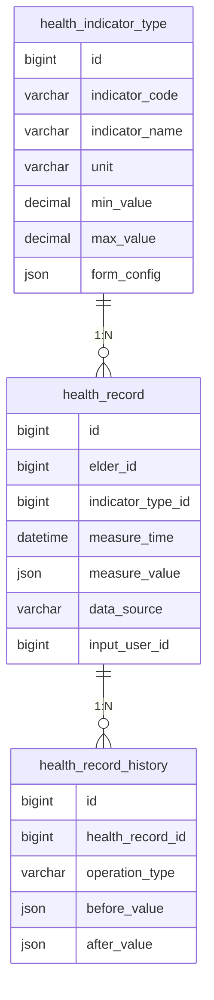

# 健康数据录入模块需求文档

## 功能概述

### 功能描述
健康数据录入模块是健康数据记录与分析模块的核心基础功能，为老年人或医护人员提供便捷的健康指标数据录入界面。该模块支持血压、血糖、体重、心率等多种常见健康指标的表单化录入，通过友好的移动端界面设计，降低老年人使用门槛，确保数据的准确性和完整性。

前端界面交互流程：
1. 用户进入健康数据录入页面，选择要录入的健康指标类型（血压、血糖、体重、心率等）
2. 根据选择的指标类型，系统展示对应的录入表单，包含必填项和可选项
3. 用户填写数据后，系统进行实时校验（如数值范围、格式等）
4. 用户提交数据，系统保存并提示录入成功
5. 可选择继续录入其他指标或返回列表页

业务逻辑处理流程：
1. 接收用户提交的健康数据
2. 数据格式校验和业务规则校验
3. 数据存储到数据库
4. 触发后续的数据分析和提醒流程

与其他模块的交互流程：
- 依赖老人档案管理模块获取老人基本信息
- 数据录入后供趋势可视化与统计分析模块使用
- 异常数据触发健康提醒与风险提示模块的提醒机制

### 功能范围
- **健康指标类型管理**: 支持血压、血糖、体重、心率等基础健康指标的录入
- **表单数据校验**: 对录入数据进行格式、范围、必填项等多维度校验
- **数据存储**: 将录入数据持久化存储，支持历史数据查询
- **批量录入支持**: 支持一次性录入多个指标数据
- **数据来源标记**: 区分手动录入、设备导入等不同数据来源

### 依赖关系
- **前置模块**: 老人档案管理模块（获取老人基本信息）
- **外部服务**: 无
- **数据依赖**: 老人档案表、健康指标配置表

## 功能需求

### 核心功能列表

| 功能编号 | 功能名称 |
|---------|---------|
| F001 | 健康指标类型配置管理 |
| F002 | 健康数据表单录入 |
| F003 | 数据实时校验 |
| F004 | 数据存储与版本管理 |
| F005 | 历史数据查询与展示 |

### 功能详细规格

#### F001: 健康指标类型配置管理
**功能描述**: 管理系统支持的健康指标类型及其配置参数，包括指标名称、单位、正常值范围、必填字段等，为数据录入提供基础配置支持。

**关键逻辑思路**:
- 支持动态配置健康指标类型，便于后续扩展
- 每个指标类型关联录入表单配置（字段定义、校验规则）
- 支持指标类型的启用/禁用状态管理
- 预置常见健康指标类型（血压、血糖、体重、心率等）

**涉及的业务规则**:
- **规则1**: 禁止删除已被使用的指标类型，只能禁用
- **规则2**: 指标类型的单位必须唯一且符合国际标准
- **规则3**: 正常值范围必须包含最小值和最大值，且最小值小于最大值

#### F002: 健康数据表单录入
**功能描述**: 提供用户友好的健康数据录入界面，支持多种健康指标的表单化录入，针对老年人特点优化交互体验。

**关键逻辑思路**:
- 根据选择的指标类型动态生成录入表单
- 表单字段支持必填/可选、数值/文本、单选/多选等多种类型
- 支持大字体、语音输入等适老化设计
- 提供常用值快捷选择（如餐前/餐后血糖）
- 支持备注信息录入

**涉及的业务规则**:
- **规则1**: 血压录入必须包含收缩压和舒张压两个数值
- **规则2**: 血糖录入必须选择测量时机（空腹、餐后1小时、餐后2小时等）
- **规则3**: 体重录入支持单位切换（kg/斤）
- **规则4**: 所有数值录入必须包含测量时间，默认为当前时间

#### F003: 数据实时校验
**功能描述**: 在用户录入数据时进行实时校验，包括格式校验、范围校验、逻辑校验等，确保数据的准确性和有效性。

**关键逻辑思路**:
- 前端实时校验：格式、必填项、数值范围
- 后端二次校验：业务规则、数据一致性
- 校验失败时给出明确的错误提示
- 支持自定义校验规则配置

**涉及的业务规则**:
- **规则1**: 收缩压范围：60-250 mmHg，舒张压范围：40-150 mmHg，且收缩压必须大于舒张压
- **规则2**: 血糖范围：1.0-30.0 mmol/L
- **规则3**: 体重范围：20-200 kg
- **规则4**: 心率范围：30-250 次/分钟
- **规则5**: 测量时间不能晚于当前时间，且不能早于老人档案创建时间

#### F004: 数据存储与版本管理
**功能描述**: 将校验通过的健康数据持久化存储，并记录数据的版本信息、操作人、操作时间等审计信息，支持数据溯源。

**关键逻辑思路**:
- 数据入库时自动生成唯一记录ID
- 记录数据来源（手动录入、设备导入等）
- 记录录入人身份（老人本人、家属、医护人员）
- 支持数据修改，保留修改历史
- 删除操作采用软删除，保留数据完整性

**涉及的业务规则**:
- **规则1**: 同一老人同一指标同一时间点的数据只能存在一条有效记录
- **规则2**: 数据修改必须记录修改前后的值及修改原因
- **规则3**: 软删除的数据不参与统计分析，但可在审计中查询

#### F005: 历史数据查询与展示
**功能描述**: 支持查询老人历史健康数据记录，提供列表展示和详情查看功能，方便用户回顾和管理健康数据。

**关键逻辑思路**:
- 支持按指标类型、时间范围、数据来源等多维度筛选
- 列表展示关键信息：测量时间、指标值、数据来源、录入人
- 支持分页查询，提高查询性能
- 详情展示完整数据信息及修改历史
- 支持数据导出功能（Excel格式）

**涉及的业务规则**:
- **规则1**: 默认查询最近30天的数据，支持自定义时间范围
- **规则2**: 列表按测量时间倒序排列
- **规则3**: 已删除的数据不显示在列表中，但可通过审计功能查询

## 数据模型

### 数据库设计

#### 表结构设计

##### health_indicator_type（健康指标类型表）
| 字段名 | 数据类型 | 长度 | 约束 | 默认值 | 说明 |
|-------|---------|------|------|-------|------|
| id | BIGINT | - | PK, AUTO_INCREMENT | - | 主键ID |
| indicator_code | VARCHAR | 50 | NOT NULL, UNIQUE | - | 指标编码（如BP、BG、WT、HR） |
| indicator_name | VARCHAR | 100 | NOT NULL | - | 指标名称（如血压、血糖、体重、心率） |
| unit | VARCHAR | 20 | NOT NULL | - | 单位（如mmHg、mmol/L、kg、次/分钟） |
| min_value | DECIMAL | 10,2 | NOT NULL | - | 最小值 |
| max_value | DECIMAL | 10,2 | NOT NULL | - | 最大值 |
| status | TINYINT | - | NOT NULL | 1 | 状态（1-启用，0-禁用） |
| sort_order | INT | - | NOT NULL | 0 | 排序序号 |
| created_at | DATETIME | - | NOT NULL | CURRENT_TIMESTAMP | 创建时间 |
| updated_at | DATETIME | - | NOT NULL | CURRENT_TIMESTAMP | 更新时间 |

**索引设计**:
- PRIMARY KEY (id)
- UNIQUE INDEX uk_indicator_code (indicator_code)
- INDEX idx_status (status)
- INDEX idx_sort_order (sort_order)

##### health_record（健康数据记录表）
| 字段名 | 数据类型 | 长度 | 约束 | 默认值 | 说明 |
|-------|---------|------|------|-------|------|
| id | BIGINT | - | PK, AUTO_INCREMENT | - | 主键ID |
| elder_id | BIGINT | - | NOT NULL | - | 老人ID（关联老人档案表） |
| indicator_type_id | BIGINT | - | NOT NULL | - | 指标类型ID |
| measure_time | DATETIME | - | NOT NULL | - | 测量时间 |
| measure_value | JSON | - | NOT NULL | - | 测量值（如收缩压/舒张压、血糖值等） |
| measure_context | JSON | - | NULL | - | 测量上下文（如餐前/餐后、体位等） |
| remark | VARCHAR | 500 | NULL | - | 备注 |
| data_source | VARCHAR | 20 | NOT NULL | - | 数据来源（MANUAL-手动录入，DEVICE-设备导入） |
| input_user_id | BIGINT | - | NOT NULL | - | 录入人ID |
| input_user_type | VARCHAR | 20 | NOT NULL | - | 录入人类型（ELDER-老人，FAMILY-家属，DOCTOR-医护人员） |
| is_deleted | TINYINT | - | NOT NULL | 0 | 删除标记（0-未删除，1-已删除） |
| created_at | DATETIME | - | NOT NULL | CURRENT_TIMESTAMP | 创建时间 |
| updated_at | DATETIME | - | NOT NULL | CURRENT_TIMESTAMP | 更新时间 |

**索引设计**:
- PRIMARY KEY (id)
- INDEX idx_elder_id (elder_id)
- INDEX idx_indicator_type_id (indicator_type_id)
- INDEX idx_measure_time (measure_time)
- INDEX idx_data_source (data_source)
- INDEX idx_is_deleted (is_deleted)
- INDEX idx_elder_measure_time (elder_id, measure_time DESC)

##### health_record_history（健康数据记录历史表）
| 字段名 | 数据类型 | 长度 | 约束 | 默认值 | 说明 |
|-------|---------|------|------|-------|------|
| id | BIGINT | - | PK, AUTO_INCREMENT | - | 主键ID |
| health_record_id | BIGINT | - | NOT NULL | - | 健康记录ID |
| operation_type | VARCHAR | 20 | NOT NULL | - | 操作类型（INSERT-新增，UPDATE-修改，DELETE-删除） |
| before_value | JSON | - | NULL | - | 修改前的值 |
| after_value | JSON | - | NULL | - | 修改后的值 |
| operation_reason | VARCHAR | 500 | NULL | - | 操作原因 |
| operator_id | BIGINT | - | NOT NULL | - | 操作人ID |
| operator_type | VARCHAR | 20 | NOT NULL | - | 操作人类型 |
| created_at | DATETIME | - | NOT NULL | CURRENT_TIMESTAMP | 创建时间 |

**索引设计**:
- PRIMARY KEY (id)
- INDEX idx_health_record_id (health_record_id)
- INDEX idx_operation_type (operation_type)
- INDEX idx_created_at (created_at)

#### 数据关系图

### 数据流图
1. 用户选择健康指标类型 → 系统查询指标类型配置 → 生成录入表单
2. 用户填写表单数据 → 前端实时校验 → 校验通过后提交到后端
3. 后端接收数据 → 二次校验 → 校验通过后保存到health_record表
4. 保存成功后 → 记录操作历史到health_record_history表 → 触发后续分析和提醒流程
5. 用户查询历史数据 → 系统根据筛选条件查询health_record表 → 返回列表数据

## 接口设计

### API 概览

#### 需要的API列表

| 接口路径 | 方法 | 处理问题 | 权限要求 |
|---------|------|---------|---------|
| /api/v1/health-data/indicator-types | POST | 创建健康指标类型 | 所有角色 |
| /api/v1/health-data/indicator-types | GET | 获取健康指标类型列表 | 所有角色 |
| /api/v1/health-data/indicator-types/{id} | GET | 获取指标类型详情 | 所有角色 |
| /api/v1/health-data/indicator-types/{id} | PUT | 修改健康指标类型 | 所有角色 |
| /api/v1/health-data/indicator-types/{id} | DELETE | 删除健康指标类型 | 所有角色 |
| /api/v1/health-data/records | POST | 录入健康数据 | 所有角色 |
| /api/v1/health-data/records | GET | 查询健康数据记录 | 所有角色 |
| /api/v1/health-data/records/{id} | GET | 获取健康数据详情 | 所有角色 |
| /api/v1/health-data/records/{id} | PUT | 修改健康数据 | 所有角色 |
| /api/v1/health-data/records/{id} | DELETE | 删除健康数据 | 所有角色 |
| /api/v1/health-data/records/{id}/history | GET | 获取数据修改历史 | 所有角色 |

##### POST /api/v1/health-data/indicator-types
**接口功能简述**: 创建新的健康指标类型，用于配置前端录入表单及校验规则
**关键处理逻辑**:
1. 接收指标编码、名称、单位、正常值范围、表单配置、状态、排序等字段
2. 校验指标编码唯一性，若已存在则返回错误
3. 持久化保存到health_indicator_type表
4. 返回创建成功的指标类型详情
**注意事项**:
- 指标编码必须唯一
- 正常值范围需要满足最小值小于最大值
**权限控制（若需要）**: 所有角色均可访问，后续可结合RBAC细化到管理员/医护人员

##### GET /api/v1/health-data/indicator-types
**接口功能简述**: 获取系统支持的健康指标类型列表，用于前端渲染指标选择器
**关键处理逻辑**: 查询health_indicator_type表记录，可按状态筛选，按排序序号排序返回
**注意事项**:
- 支持使用status参数筛选启用/禁用状态
- 返回结果中包含表单配置信息
**权限控制（若需要）**: 所有角色均可访问

##### GET /api/v1/health-data/indicator-types/{id}
**接口功能简述**: 获取指定健康指标类型的详细信息，包括表单配置和校验规则
**关键处理逻辑**: 根据ID查询health_indicator_type表，返回完整的指标类型信息
**注意事项**: 如果指标类型不存在，返回404错误
**权限控制（若需要）**: 所有角色均可访问

##### PUT /api/v1/health-data/indicator-types/{id}
**接口功能简述**: 更新已存在的健康指标类型配置
**关键处理逻辑**:
1. 根据ID查询指标类型是否存在
2. 支持修改名称、单位、正常值范围、表单配置、状态、排序等字段
3. 如果修改了指标编码，需要再次校验编码唯一性
4. 更新成功后返回最新的指标类型详情
**注意事项**:
- 仅允许修改配置相关字段，不影响既有健康数据记录
- 修改后的配置会影响后续录入和校验逻辑
**权限控制（若需要）**: 所有角色均可访问，后续可结合RBAC细化到管理员/医护人员

##### DELETE /api/v1/health-data/indicator-types/{id}
**接口功能简述**: 删除指定的健康指标类型
**关键处理逻辑**:
1. 根据ID校验指标类型是否存在
2. 执行删除操作
3. 返回删除结果
**注意事项**:
- 当前实现为物理删除，后续可根据业务需要调整为禁用或软删除
**权限控制（若需要）**: 所有角色均可访问，后续可结合RBAC细化到管理员/医护人员

##### POST /api/v1/health-data/records
**接口功能简述**: 录入新的健康数据记录
**关键处理逻辑**:
1. 接收请求参数，解析指标类型ID、测量值、测量时间等
2. 根据指标类型ID查询配置信息，获取校验规则
3. 执行数据校验（格式、范围、必填项等）
4. 校验通过后，插入health_record表
5. 记录操作历史到health_record_history表
6. 返回创建成功的记录信息
**注意事项**:
- 必须校验老人ID是否存在且有效
- 测量时间不能晚于当前时间
- 同一老人同一指标同一时间点的数据不能重复录入
**权限控制（若需要）**: 所有角色均可录入，但需记录录入人身份

##### GET /api/v1/health-data/records
**接口功能简述**: 查询健康数据记录列表，支持多维度筛选和分页
**关键处理逻辑**:
1. 接收筛选参数（老人ID、指标类型ID、时间范围、数据来源等）
2. 构建查询条件，查询health_record表
3. 按测量时间倒序排列
4. 支持分页查询
5. 返回列表数据
**注意事项**:
- 默认只查询未删除的记录
- 时间范围由调用方通过start_date和end_date参数指定
- 当前支持按单个指标类型ID筛选
**权限控制（若需要）**: 老人只能查看自己的数据，家属可查看关联老人的数据，医护人员可查看负责老人的数据

##### GET /api/v1/health-data/records/{id}
**接口功能简述**: 获取指定健康数据记录的详细信息
**关键处理逻辑**: 根据ID查询health_record表，返回完整的记录信息，包括指标类型详情
**注意事项**: 如果记录不存在或已删除，返回404错误
**权限控制（若需要）**: 老人只能查看自己的数据，家属可查看关联老人的数据，医护人员可查看负责老人的数据

##### PUT /api/v1/health-data/records/{id}
**接口功能简述**: 修改已存在的健康数据记录
**关键处理逻辑**:
1. 接收修改参数，校验记录是否存在且未删除
2. 执行数据校验（格式、范围、必填项等）
3. 校验通过后，更新health_record表
4. 记录修改历史到health_record_history表（包含修改前后的值）
5. 返回更新后的记录信息
**注意事项**:
- 必须记录修改原因
- 修改后的数据必须符合校验规则
- 只能修改最近7天内录入的数据，超过7天的数据不允许修改
**权限控制（若需要）**: 老人只能修改自己的数据，家属可修改关联老人的数据，医护人员可修改负责老人的数据

##### DELETE /api/v1/health-data/records/{id}
**接口功能简述**: 删除指定的健康数据记录（软删除）
**关键处理逻辑**:
1. 校验记录是否存在且未删除
2. 更新health_record表的is_deleted字段为1
3. 记录删除历史到health_record_history表
4. 返回删除成功
**注意事项**:
- 采用软删除，不物理删除数据
- 必须记录删除原因
- 只能删除最近7天内录入的数据，超过7天的数据不允许删除
**权限控制（若需要）**: 老人只能删除自己的数据，家属可删除关联老人的数据，医护人员可删除负责老人的数据

##### GET /api/v1/health-data/records/{id}/history
**接口功能简述**: 获取指定健康数据记录的修改历史
**关键处理逻辑**: 根据health_record_id查询health_record_history表，按创建时间倒序返回历史记录
**注意事项**: 返回完整的操作历史，包括操作人、操作时间、操作类型、修改前后的值等
**权限控制（若需要）**: 老人只能查看自己的数据历史，家属可查看关联老人的数据历史，医护人员可查看负责老人的数据历史

**API文档说明**: 具体的请求参数、响应格式、错误码等细节请参考 Swagger 文档。

### 架构设计
模块采用分层架构设计：
- **表现层**: 负责前端页面展示和用户交互，使用鸿蒙ArkTS开发移动端界面
- **接口层**: 提供RESTful API接口，处理HTTP请求和响应
- **业务逻辑层**: 实现数据校验、业务规则处理、数据转换等核心逻辑
- **数据访问层**: 负责数据库操作，使用ORM框架简化数据访问
- **数据层**: MySQL数据库存储健康数据

### 关键技术点
1. **动态表单生成**: 根据指标类型配置动态生成录入表单，支持灵活扩展新的健康指标类型
2. **实时数据校验**: 前端和后端双重校验机制，确保数据准确性
3. **JSON字段存储**: 使用JSON类型存储测量值和上下文信息，支持不同指标类型的灵活数据结构
4. **数据版本管理**: 通过历史表记录数据变更，支持数据溯源和审计
5. **软删除机制**: 采用标记删除而非物理删除，保证数据完整性和可追溯性
