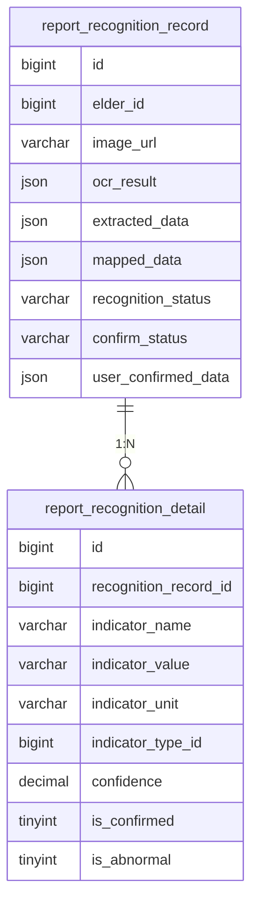

# 报告辅助录入模块需求文档

## 功能概述

### 功能描述
报告辅助录入模块通过OCR（光学字符识别）技术，支持用户上传体检报告或纸质检测单的图片，系统自动识别并解析其中的健康数据，将其转换为结构化数据并填充到健康数据录入表单中。该模块旨在降低用户手动录入的工作量，提高数据录入效率和准确性。

前端界面交互流程：
1. 用户进入报告辅助录入页面，点击上传报告图片
2. 用户从相册选择或拍摄体检报告/检测单图片
3. 系统上传图片并进行OCR识别
4. 系统解析识别结果，提取健康数据
5. 用户确认或修正提取的数据
6. 用户提交确认后的数据，系统保存到健康记录表

业务逻辑处理流程：
1. 接收用户上传的图片文件
2. 调用OCR服务进行文字识别
3. 解析识别结果，提取健康指标数据
4. 将提取的数据映射到对应的健康指标类型
5. 用户确认后，调用健康数据录入接口保存数据

与其他模块的交互流程：
- 依赖健康数据录入模块保存解析后的数据
- 依赖老人档案管理模块获取老人基本信息
- 解析后的数据供趋势可视化与统计分析模块使用

### 功能范围
- **图片上传**: 支持从相册选择或拍照上传体检报告/检测单图片
- **OCR识别**: 调用OCR服务识别图片中的文字内容
- **数据提取**: 从识别结果中提取健康指标数据
- **数据映射**: 将提取的数据映射到对应的健康指标类型
- **人工确认**: 用户可查看、修正提取的数据后再提交
- **识别历史**: 保存识别记录，支持历史查询

### 依赖关系
- **前置模块**: 健康数据录入模块、老人档案管理模块
- **外部服务**: OCR识别服务（如百度OCR、腾讯OCR等）
- **数据依赖**: 健康记录表、报告识别记录表

## 功能需求

### 核心功能列表

| 功能编号 | 功能名称 |
|---------|---------|
| F001 | 图片上传与预处理 |
| F002 | OCR文字识别 |
| F003 | 健康数据提取 |
| F004 | 数据映射与校验 |
| F005 | 人工确认与修正 |
| F006 | 识别记录管理 |

### 功能详细规格

#### F001: 图片上传与预处理
**功能描述**: 提供用户友好的图片上传界面，支持从相册选择或拍照上传，并对上传的图片进行预处理，提高OCR识别准确率。

**关键逻辑思路**:
- 支持从相册选择图片或直接拍照
- 限制图片大小和格式（支持JPG、PNG格式，最大10MB）
- 对上传的图片进行预处理：压缩、裁剪、旋转、增强对比度等
- 显示图片预览，支持重新上传
- 上传过程中显示进度提示

**涉及的业务规则**:
- **规则1**: 图片格式仅支持JPG和PNG
- **规则2**: 图片大小不能超过10MB，超过则自动压缩
- **规则3**: 图片分辨率不低于800x600，低于则提示用户重新上传
- **规则4**: 同一用户同一时间只能上传一张图片进行识别

#### F002: OCR文字识别
**功能描述**: 调用OCR服务对上传的图片进行文字识别，将图片中的文字内容转换为可编辑的文本。

**关键逻辑思路**:
- 调用第三方OCR服务API进行文字识别
- 支持中英文混合识别
- 识别结果包含文字内容、位置信息、置信度等
- 对识别结果进行后处理：去除噪点、纠正错别字等
- 记录识别结果和识别时间

**涉及的业务规则**:
- **规则1**: OCR识别超时时间为30秒，超时则提示用户重试
- **规则2**: 识别失败（如图片质量差、内容无法识别）则提示用户重新上传
- **规则3**: 识别结果的置信度低于60%时，提示用户可能存在识别错误，建议人工核对
- **规则4**: 同一图片最多识别3次，超过则提示用户更换图片

#### F003: 健康数据提取
**功能描述**: 从OCR识别结果中提取健康指标数据，包括指标名称、数值、单位、测量时间等信息。

**关键逻辑思路**:
- 基于关键词匹配和正则表达式提取健康指标数据
- 支持多种报告格式：体检报告、化验单、检测单等
- 提取的指标包括：血压、血糖、血脂、肝功能、肾功能、血常规等
- 提取测量时间（报告日期、检测日期等）
- 对提取的数据进行初步清洗和标准化

**涉及的业务规则**:
- **规则1**: 提取的指标数值必须包含单位，否则标记为待确认
- **规则2**: 提取的测量时间优先使用报告日期，其次使用检测日期
- **规则3**: 无法识别的指标标记为"其他"，不自动录入
- **规则4**: 同一指标提取到多个数值时，取置信度最高的一个

#### F004: 数据映射与校验
**功能描述**: 将提取的健康数据映射到系统定义的健康指标类型，并进行数据校验，确保数据的准确性和完整性。

**关键逻辑思路**:
- 根据指标名称和单位匹配系统定义的健康指标类型
- 对提取的数值进行范围校验
- 对测量时间进行格式校验
- 校验失败的数据标记为待确认，不自动录入
- 生成数据映射报告，显示映射成功和失败的数据

**涉及的业务规则**:
- **规则1**: 无法匹配到系统指标类型的数据不自动录入
- **规则2**: 数值超出正常范围的数据标记为异常，但仍可录入
- **规则3**: 测量时间缺失的数据默认使用当前时间
- **规则4**: 单位不匹配的数据进行单位转换，转换失败则标记为待确认

#### F005: 人工确认与修正
**功能描述**: 用户可查看提取和映射后的健康数据，对数据进行确认或修正，确保数据的准确性。

**关键逻辑思路**:
- 以表单形式展示提取的数据，支持用户查看和编辑
- 标记待确认和异常的数据，提醒用户重点核对
- 支持用户删除不需要的数据
- 支持用户添加未提取到的数据
- 用户确认后，调用健康数据录入接口保存数据

**涉及的业务规则**:
- **规则1**: 待确认的数据必须用户确认后才能提交
- **规则2**: 异常数据用户可选择保留或删除
- **规则3**: 用户修正后的数据必须通过校验才能提交
- **规则4**: 提交成功后，记录用户确认和修正的操作

#### F006: 识别记录管理
**功能描述**: 保存每次报告识别的记录，包括上传的图片、识别结果、提取的数据、用户确认情况等，支持历史查询和追溯。

**关键逻辑思路**:
- 保存识别记录到数据库
- 记录识别时间、识别结果、提取的数据、用户确认情况
- 支持按时间范围、识别状态等条件查询历史记录
- 支持查看识别详情，包括原始图片和识别结果
- 支持重新识别历史图片

**涉及的业务规则**:
- **规则1**: 识别记录保留1年，超过1年的记录自动归档
- **规则2**: 用户只能查看自己的识别记录
- **规则3**: 识别记录删除后，对应提取的健康数据不受影响
- **规则4**: 重新识别历史图片时，生成新的识别记录

## 数据模型

### 数据库设计

#### 表结构设计

##### report_recognition_record（报告识别记录表）
| 字段名 | 数据类型 | 长度 | 约束 | 默认值 | 说明 |
|-------|---------|------|------|-------|------|
| id | BIGINT | - | PK, AUTO_INCREMENT | - | 主键ID |
| elder_id | BIGINT | - | NOT NULL | - | 老人ID |
| image_url | VARCHAR | 500 | NOT NULL | - | 图片URL |
| image_size | INT | - | NOT NULL | - | 图片大小（字节） |
| ocr_result | JSON | - | NULL | - | OCR识别结果 |
| extracted_data | JSON | - | NULL | - | 提取的健康数据 |
| mapped_data | JSON | - | NULL | - | 映射后的健康数据 |
| recognition_status | VARCHAR | 20 | NOT NULL | - | 识别状态（PENDING-待识别，SUCCESS-成功，FAILED-失败） |
| confirm_status | VARCHAR | 20 | NOT NULL | - | 确认状态（PENDING-待确认，CONFIRMED-已确认，REJECTED-已拒绝） |
| user_confirmed_data | JSON | - | NULL | - | 用户确认后的数据 |
| error_message | VARCHAR | 500 | NULL | - | 错误信息 |
| created_by | BIGINT | - | NOT NULL | - | 创建人ID |
| created_at | DATETIME | - | NOT NULL | CURRENT_TIMESTAMP | 创建时间 |
| updated_at | DATETIME | - | NOT NULL | CURRENT_TIMESTAMP | 更新时间 |

**索引设计**:
- PRIMARY KEY (id)
- INDEX idx_elder_id (elder_id)
- INDEX idx_recognition_status (recognition_status)
- INDEX idx_confirm_status (confirm_status)
- INDEX idx_created_at (created_at)

##### report_recognition_detail（报告识别详情表）
| 字段名 | 数据类型 | 长度 | 约束 | 默认值 | 说明 |
|-------|---------|------|------|-------|------|
| id | BIGINT | - | PK, AUTO_INCREMENT | - | 主键ID |
| recognition_record_id | BIGINT | - | NOT NULL | - | 识别记录ID |
| indicator_name | VARCHAR | 100 | NOT NULL | - | 指标名称 |
| indicator_value | VARCHAR | 100 | NOT NULL | - | 指标值 |
| indicator_unit | VARCHAR | 20 | NULL | - | 单位 |
| indicator_type_id | BIGINT | - | NULL | - | 映射的指标类型ID |
| confidence | DECIMAL | 5,2 | NULL | - | 置信度（0-100） |
| is_confirmed | TINYINT | - | NOT NULL | 0 | 是否确认（0-未确认，1-已确认） |
| is_abnormal | TINYINT | - | NOT NULL | 0 | 是否异常（0-正常，1-异常） |
| remark | VARCHAR | 500 | NULL | - | 备注 |
| created_at | DATETIME | - | NOT NULL | CURRENT_TIMESTAMP | 创建时间 |

**索引设计**:
- PRIMARY KEY (id)
- INDEX idx_recognition_record_id (recognition_record_id)
- INDEX idx_indicator_type_id (indicator_type_id)
- INDEX idx_is_confirmed (is_confirmed)

#### 数据关系图

### 数据流图
1. 用户上传图片 → 图片预处理 → 调用OCR服务 → 返回识别结果
2. 解析识别结果 → 提取健康数据 → 映射到指标类型 → 数据校验
3. 生成识别记录 → 保存到report_recognition_record表 → 保存详情到report_recognition_detail表
4. 用户查看提取的数据 → 确认或修正数据 → 提交确认后的数据
5. 调用健康数据录入接口 → 保存到health_record表 → 更新识别记录状态

## 接口设计

### API 概览

#### 需要的API列表

| 接口路径 | 方法 | 处理问题 | 权限要求 |
|---------|------|---------|---------|
| POST /api/v1/report-recognition/upload | POST | 上传报告图片 | 所有角色 |
| POST /api/v1/report-recognition/{id}/recognize | POST | 执行OCR识别 | 所有角色 |
| GET /api/v1/report-recognition/{id} | GET | 获取识别记录详情 | 所有角色 |
| GET /api/v1/report-recognition | GET | 查询识别记录列表 | 所有角色 |
| POST /api/v1/report-recognition/{id}/confirm | POST | 确认识别结果 | 所有角色 |
| POST /api/v1/report-recognition/{id}/reject | POST | 拒绝识别结果 | 所有角色 |
| DELETE /api/v1/report-recognition/{id} | DELETE | 删除识别记录 | 所有角色 |

##### POST /api/v1/report-recognition/upload
**接口功能简述**: 上传报告图片，保存图片并创建识别记录
**关键处理逻辑**:
1. 接收上传的图片文件
2. 校验图片格式和大小
3. 对图片进行预处理（压缩、裁剪等）
4. 保存图片到文件存储服务，获取图片URL
5. 创建识别记录，状态为PENDING
6. 返回识别记录ID和图片URL
**注意事项**:
- 图片格式仅支持JPG和PNG
- 图片大小不能超过10MB
- 同一用户同一时间只能有一个待识别的记录
**权限控制（若需要）**: 所有角色均可上传

##### POST /api/v1/report-recognition/{id}/recognize
**接口功能简述**: 对已上传的图片执行OCR识别
**关键处理逻辑**:
1. 校验识别记录是否存在且状态为PENDING
2. 获取图片URL
3. 调用OCR服务进行文字识别
4. 解析识别结果，提取健康数据
5. 将提取的数据映射到指标类型
6. 更新识别记录状态和结果
7. 返回识别结果
**注意事项**:
- OCR识别超时时间为30秒
- 识别失败则更新状态为FAILED，记录错误信息
- 识别成功则更新状态为SUCCESS，保存识别结果和提取的数据
**权限控制（若需要）**: 只有创建人可以执行识别

##### GET /api/v1/report-recognition/{id}
**接口功能简述**: 获取指定识别记录的详细信息
**关键处理逻辑**:
1. 根据ID查询识别记录
2. 查询识别详情列表
3. 返回完整的识别记录信息，包括图片URL、识别结果、提取的数据等
**注意事项**:
- 如果记录不存在，返回404错误
- 返回的数据包含OCR识别结果和提取的健康数据
**权限控制（若需要）**: 用户只能查看自己的识别记录

##### GET /api/v1/report-recognition
**接口功能简述**: 查询识别记录列表，支持按状态、时间范围等条件筛选
**关键处理逻辑**:
1. 接收筛选参数（识别状态、确认状态、时间范围等）
2. 构建查询条件，查询识别记录表
3. 按创建时间倒序排列
4. 支持分页查询
5. 返回列表数据
**注意事项**:
- 默认查询最近30天的记录
- 用户只能查询自己的识别记录
**权限控制（若需要）**: 用户只能查询自己的识别记录

##### POST /api/v1/report-recognition/{id}/confirm
**接口功能简述**: 确认识别结果，将用户确认后的数据保存到健康记录表
**关键处理逻辑**:
1. 校验识别记录是否存在且状态为SUCCESS
2. 接收用户确认后的数据
3. 对确认后的数据进行校验
4. 调用健康数据录入接口，批量保存数据
5. 更新识别记录状态为CONFIRMED
6. 返回保存结果
**注意事项**:
- 确认后的数据必须通过校验
- 保存失败则更新识别记录状态为FAILED，记录错误信息
- 保存成功则更新识别记录状态为CONFIRMED
**权限控制（若需要）**: 只有创建人可以确认识别结果

##### POST /api/v1/report-recognition/{id}/reject
**接口功能简述**: 拒绝识别结果，不保存数据
**关键处理逻辑**:
1. 校验识别记录是否存在且状态为SUCCESS
2. 更新识别记录状态为REJECTED
3. 记录拒绝原因（可选）
4. 返回操作结果
**注意事项**:
- 拒绝后，识别记录保留，但不保存任何健康数据
- 用户可以重新上传图片进行识别
**权限控制（若需要）**: 只有创建人可以拒绝识别结果

##### DELETE /api/v1/report-recognition/{id}
**接口功能简述**: 删除指定的识别记录
**关键处理逻辑**:
1. 校验识别记录是否存在
2. 删除识别记录和关联的识别详情
3. 删除对应的图片文件
4. 返回删除结果
**注意事项**:
- 删除识别记录不影响已保存的健康数据
- 删除操作不可恢复
**权限控制（若需要）**: 只有创建人可以删除识别记录

**API文档说明**: 具体的请求参数、响应格式、错误码等细节请参考 Swagger 文档。

### 架构设计
模块采用分层架构设计：
- **表现层**: 负责前端页面展示和用户交互，使用鸿蒙ArkTS开发移动端界面
- **接口层**: 提供RESTful API接口，处理HTTP请求和响应
- **业务逻辑层**: 实现OCR识别、数据提取、数据映射等核心逻辑
- **OCR服务层**: 封装第三方OCR服务调用，支持多种OCR服务切换
- **数据访问层**: 负责数据库操作，使用ORM框架简化数据访问
- **文件存储层**: 负责图片文件的存储和管理
- **数据层**: MySQL数据库存储识别记录

### 关键技术点
1. **OCR技术**: 调用第三方OCR服务进行文字识别，支持中英文混合识别
2. **数据提取**: 基于关键词匹配和正则表达式提取健康指标数据
3. **数据映射**: 将提取的数据映射到系统定义的健康指标类型
4. **图片预处理**: 对上传的图片进行压缩、裁剪、增强对比度等处理，提高识别准确率
5. **异步处理**: OCR识别采用异步处理，避免阻塞用户操作
6. **错误处理**: 完善的错误处理机制，识别失败时给出明确的错误提示

### 性能优化策略
- **图片压缩**: 对上传的图片进行压缩，减少网络传输和存储成本
- **异步识别**: OCR识别采用异步处理，提高系统响应速度
- **缓存策略**: 对识别结果进行缓存，避免重复识别
- **批量处理**: 支持批量识别，提高识别效率
- **图片CDN**: 使用CDN加速图片访问
- **分页查询**: 列表查询支持分页，避免一次性加载大量数据
