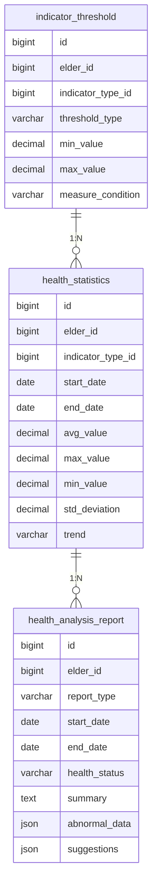

# 趋势可视化与统计分析模块需求文档

## 功能概述

### 功能描述
趋势可视化与统计分析模块通过图表展示老年人的健康数据变化趋势，并基于设定的阈值分析健康状态，为老年人、家属和医护人员提供直观的健康状况可视化工具。该模块支持多种图表类型、灵活的时间范围选择和自定义阈值配置，帮助用户及时发现健康问题。

前端界面交互流程：
1. 用户进入趋势可视化页面，选择要查看的指标类型（血压、血糖、体重、心率等）
2. 选择时间范围（最近7天、最近30天、最近90天、自定义）
3. 系统根据选择生成趋势图表（折线图、柱状图等）
4. 用户可查看图表详情，包括数据点信息、平均值、最大值、最小值等
5. 系统根据阈值分析健康状态，标记异常数据点
6. 用户可导出图表或数据

业务逻辑处理流程：
1. 接收用户查询参数（指标类型、时间范围等）
2. 从数据库查询对应的健康数据记录
3. 对数据进行统计计算（平均值、最大值、最小值、标准差等）
4. 根据阈值判断健康状态（正常、偏高、偏低）
5. 生成图表数据格式
6. 返回可视化数据和统计信息

与其他模块的交互流程：
- 依赖健康数据录入模块获取健康数据
- 依赖健康提醒与风险提示模块触发异常提醒
- 分析结果供多角色协同与服务模块使用

### 功能范围
- **趋势图表展示**: 支持多种图表类型展示健康数据变化趋势
- **统计分析**: 计算平均值、最大值、最小值、标准差等统计指标
- **健康状态分析**: 基于阈值判断健康状态，标记异常数据
- **多指标对比**: 支持同时查看多个指标的趋势对比
- **数据导出**: 支持导出图表和数据为Excel或PDF格式
- **自定义阈值**: 支持用户自定义健康指标的阈值范围

### 依赖关系
- **前置模块**: 健康数据录入模块
- **外部服务**: 无
- **数据依赖**: 健康记录表、指标阈值配置表

## 功能需求

### 核心功能列表

| 功能编号 | 功能名称 |
|---------|---------|
| F001 | 趋势图表展示 |
| F002 | 统计分析计算 |
| F003 | 健康状态分析 |
| F004 | 多指标对比 |
| F005 | 数据导出 |
| F006 | 自定义阈值管理 |

### 功能详细规格

#### F001: 趋势图表展示
**功能描述**: 使用图表展示健康数据的变化趋势，支持多种图表类型和时间范围选择，为用户提供直观的数据可视化体验。

**关键逻辑思路**:
- 支持折线图、柱状图、散点图等多种图表类型
- 支持按时间范围筛选（最近7天、最近30天、最近90天、自定义）
- 支持按指标类型筛选（血压、血糖、体重、心率等）
- 图表支持交互操作：缩放、平移、数据点悬停显示详情
- 支持图表样式自定义（颜色、线宽、字体大小等）
- 针对老年人优化：大字体、高对比度、简洁布局

**涉及的业务规则**:
- **规则1**: 默认显示最近30天的数据
- **规则2**: 折线图适用于连续型数据（血压、血糖、心率等）
- **规则3**: 柱状图适用于离散型数据（体重等）
- **规则4**: 图表X轴为时间，Y轴为指标值
- **规则5**: 数据点数量超过100时，自动进行数据采样，提高渲染性能

#### F002: 统计分析计算
**功能描述**: 对查询的健康数据进行统计分析，计算平均值、最大值、最小值、标准差、中位数等统计指标，帮助用户了解健康数据的整体情况。

**关键逻辑思路**:
- 计算平均值：所有数据的算术平均值
- 计算最大值和最小值：数据中的最大值和最小值
- 计算标准差：衡量数据的离散程度
- 计算中位数：数据排序后位于中间位置的值
- 计算异常值：超出阈值范围的数据点数量和比例
- 计算趋势：数据的上升或下降趋势（线性回归）

**涉及的业务规则**:
- **规则1**: 统计分析至少需要3个数据点
- **规则2**: 缺失值不参与统计计算
- **规则3**: 异常值参与统计计算，但单独标记
- **规则4**: 趋势分析至少需要5个数据点
- **规则5**: 统计结果保留2位小数

#### F003: 健康状态分析
**功能描述**: 基于设定的阈值判断健康状态，标记异常数据点，为用户提供健康状态评估。

**关键逻辑思路**:
- 根据指标类型和用户自定义阈值判断健康状态
- 健康状态分为：正常、偏高、偏低、严重偏高、严重偏低
- 在图表中用不同颜色标记异常数据点
- 生成健康状态报告，包括异常数据点列表和健康建议
- 支持健康状态趋势分析（改善、稳定、恶化）

**涉及的业务规则**:
- **规则1**: 数值在正常范围内，状态为正常
- **规则2**: 数值超出正常范围10%以内，状态为偏高或偏低
- **规则3**: 数值超出正常范围10%-30%，状态为严重偏高或严重偏低
- **规则4**: 数值超出正常范围30%以上，状态为危急
- **规则5**: 连续3次测量结果异常，标记为持续异常

#### F004: 多指标对比
**功能描述**: 支持同时查看多个指标的趋势对比，帮助用户发现指标之间的关联性。

**关键逻辑思路**:
- 支持选择多个指标类型进行对比
- 使用双Y轴图表展示不同量纲的指标
- 支持指标之间的相关性分析
- 支持指标之间的比值计算（如收缩压/舒张压）
- 支持自定义指标组合

**涉及的业务规则**:
- **规则1**: 最多同时对比4个指标
- **规则2**: 不同指标的图表类型必须一致
- **规则3**: 时间范围必须一致
- **规则4**: 相关性分析至少需要10个数据点

#### F005: 数据导出
**功能描述**: 支持将图表和数据导出为Excel或PDF格式，方便用户保存和分享。

**关键逻辑思路**:
- 支持导出图表为图片格式（PNG、JPG）
- 支持导出数据为Excel格式
- 支持导出完整报告为PDF格式（包含图表、统计数据、健康状态分析）
- 导出的文件包含老人基本信息、导出时间、数据来源等元数据
- 支持自定义导出内容（仅图表、仅数据、完整报告）

**涉及的业务规则**:
- **规则1**: 导出的文件命名格式为：老人姓名_指标类型_时间范围_导出时间
- **规则2**: 导出操作记录日志，包括导出人、导出时间、导出内容
- **规则3**: 导出的数据不包含已删除的记录
- **规则4**: 导出的PDF报告包含页眉、页脚、图表说明等信息

#### F006: 自定义阈值管理
**功能描述**: 支持用户自定义健康指标的阈值范围，满足不同用户的个性化需求。

**关键逻辑思路**:
- 支持为每个指标类型设置自定义阈值
- 阈值包括：正常范围、偏高范围、偏低范围、危急范围
- 支持按时间段设置不同的阈值（如白天和夜间的血压阈值）
- 支持按测量条件设置不同的阈值（如餐前和餐后的血糖阈值）
- 支持导入和导出阈值配置

**涉及的业务规则**:
- **规则1**: 默认使用系统预设阈值，用户可自定义覆盖
- **规则2**: 自定义阈值必须在系统允许的范围内
- **规则3**: 阈值修改后，历史数据的健康状态重新计算
- **规则4**: 阈值修改记录日志，包括修改人、修改时间、修改内容

## 数据模型

### 数据库设计

#### 表结构设计

##### indicator_threshold（指标阈值配置表）
| 字段名 | 数据类型 | 长度 | 约束 | 默认值 | 说明 |
|-------|---------|------|------|-------|------|
| id | BIGINT | - | PK, AUTO_INCREMENT | - | 主键ID |
| elder_id | BIGINT | - | NOT NULL | - | 老人ID（NULL表示系统默认阈值） |
| indicator_type_id | BIGINT | - | NOT NULL | - | 指标类型ID |
| threshold_type | VARCHAR | 20 | NOT NULL | - | 阈值类型（NORMAL-正常，HIGH-偏高，LOW-偏低，CRITICAL-危急） |
| min_value | DECIMAL | 10,2 | NULL | - | 最小值 |
| max_value | DECIMAL | 10,2 | NULL | - | 最大值 |
| measure_condition | VARCHAR | 50 | NULL | - | 测量条件（如餐前、餐后、白天、夜间） |
| is_default | TINYINT | - | NOT NULL | 0 | 是否默认阈值（1-是，0-否） |
| created_by | BIGINT | - | NOT NULL | - | 创建人ID |
| created_at | DATETIME | - | NOT NULL | CURRENT_TIMESTAMP | 创建时间 |
| updated_at | DATETIME | - | NOT NULL | CURRENT_TIMESTAMP | 更新时间 |

**索引设计**:
- PRIMARY KEY (id)
- INDEX idx_elder_id (elder_id)
- INDEX idx_indicator_type_id (indicator_type_id)
- INDEX idx_threshold_type (threshold_type)
- UNIQUE INDEX uk_elder_indicator_condition (elder_id, indicator_type_id, threshold_type, measure_condition)

##### health_statistics（健康统计数据表）
| 字段名 | 数据类型 | 长度 | 约束 | 默认值 | 说明 |
|-------|---------|------|------|-------|------|
| id | BIGINT | - | PK, AUTO_INCREMENT | - | 主键ID |
| elder_id | BIGINT | - | NOT NULL | - | 老人ID |
| indicator_type_id | BIGINT | - | NOT NULL | - | 指标类型ID |
| start_date | DATE | - | NOT NULL | - | 统计开始日期 |
| end_date | DATE | - | NOT NULL | - | 统计结束日期 |
| avg_value | DECIMAL | 10,2 | NULL | - | 平均值 |
| max_value | DECIMAL | 10,2 | NULL | - | 最大值 |
| min_value | DECIMAL | 10,2 | NULL | - | 最小值 |
| std_deviation | DECIMAL | 10,2 | NULL | - | 标准差 |
| median_value | DECIMAL | 10,2 | NULL | - | 中位数 |
| abnormal_count | INT | - | NOT NULL | 0 | 异常数据点数量 |
| total_count | INT | - | NOT NULL | 0 | 总数据点数量 |
| trend | VARCHAR | 20 | NULL | - | 趋势（UP-上升，DOWN-下降，STABLE-稳定） |
| created_at | DATETIME | - | NOT NULL | CURRENT_TIMESTAMP | 创建时间 |
| updated_at | DATETIME | - | NOT NULL | CURRENT_TIMESTAMP | 更新时间 |

**索引设计**:
- PRIMARY KEY (id)
- INDEX idx_elder_id (elder_id)
- INDEX idx_indicator_type_id (indicator_type_id)
- INDEX idx_start_date (start_date)
- INDEX idx_end_date (end_date)
- UNIQUE INDEX uk_elder_indicator_date (elder_id, indicator_type_id, start_date, end_date)

##### health_analysis_report（健康分析报告表）
| 字段名 | 数据类型 | 长度 | 约束 | 默认值 | 说明 |
|-------|---------|------|------|-------|------|
| id | BIGINT | - | PK, AUTO_INCREMENT | - | 主键ID |
| elder_id | BIGINT | - | NOT NULL | - | 老人ID |
| report_type | VARCHAR | 20 | NOT NULL | - | 报告类型（DAILY-日报，WEEKLY-周报，MONTHLY-月报，CUSTOM-自定义） |
| start_date | DATE | - | NOT NULL | - | 报告开始日期 |
| end_date | DATE | - | NOT NULL | - | 报告结束日期 |
| health_status | VARCHAR | 20 | NOT NULL | - | 健康状态（GOOD-良好，NORMAL-正常，WARNING-警告，DANGER-危险） |
| summary | TEXT | - | NULL | - | 健康状况摘要 |
| abnormal_data | JSON | - | NULL | - | 异常数据列表 |
| suggestions | JSON | - | NULL | - | 健康建议 |
| chart_data | JSON | - | NULL | - | 图表数据 |
| created_at | DATETIME | - | NOT NULL | CURRENT_TIMESTAMP | 创建时间 |

**索引设计**:
- PRIMARY KEY (id)
- INDEX idx_elder_id (elder_id)
- INDEX idx_report_type (report_type)
- INDEX idx_start_date (start_date)
- INDEX idx_end_date (end_date)
- INDEX idx_created_at (created_at)

#### 数据关系图

### 数据流图
1. 用户查询趋势数据 → 系统查询健康记录 → 计算统计数据 → 生成图表数据 → 返回可视化数据
2. 系统定期计算统计数据 → 查询健康记录 → 计算统计指标 → 保存到health_statistics表
3. 系统定期生成健康分析报告 → 查询统计数据 → 分析健康状态 → 生成报告 → 保存到health_analysis_report表
4. 用户自定义阈值 → 保存到indicator_threshold表 → 重新计算历史数据的健康状态

## 接口设计

### API 概览

#### 需要的API列表

| 接口路径 | 方法 | 处理问题 | 权限要求 |
|---------|------|---------|---------|
| GET /api/v1/health-trend/chart-data | GET | 获取趋势图表数据 | 所有角色 |
| GET /api/v1/health-trend/statistics | GET | 获取统计数据 | 所有角色 |
| GET /api/v1/health-trend/health-status | GET | 获取健康状态分析 | 所有角色 |
| GET /api/v1/health-trend/compare | GET | 获取多指标对比数据 | 所有角色 |
| POST /api/v1/health-trend/export | POST | 导出数据或图表 | 所有角色 |
| GET /api/v1/health-trend/thresholds | GET | 获取阈值配置 | 所有角色 |
| POST /api/v1/health-trend/thresholds | POST | 创建或更新阈值配置 | 所有角色 |
| DELETE /api/v1/health-trend/thresholds/{id} | DELETE | 删除阈值配置 | 所有角色 |

##### GET /api/v1/health-trend/chart-data
**接口功能简述**: 获取健康数据的趋势图表数据
**关键处理逻辑**:
1. 接收查询参数（老人ID、指标类型ID、时间范围、图表类型等）
2. 查询健康记录表，获取指定时间范围内的数据
3. 对数据进行排序和采样（如果数据点过多）
4. 生成图表数据格式（X轴时间、Y轴值、数据点信息等）
5. 返回图表数据
**注意事项**:
- 时间范围默认为最近30天
- 数据点数量超过100时，自动进行数据采样
- 支持多个指标类型同时查询
**权限控制（若需要）**: 老人只能查看自己的数据，家属可查看关联老人的数据，医护人员可查看负责老人的数据

##### GET /api/v1/health-trend/statistics
**接口功能简述**: 获取健康数据的统计分析结果
**关键处理逻辑**:
1. 接收查询参数（老人ID、指标类型ID、时间范围等）
2. 查询健康记录表，获取指定时间范围内的数据
3. 计算统计指标（平均值、最大值、最小值、标准差、中位数等）
4. 计算趋势（线性回归）
5. 返回统计数据
**注意事项**:
- 统计分析至少需要3个数据点
- 趋势分析至少需要5个数据点
- 统计结果保留2位小数
**权限控制（若需要）**: 老人只能查看自己的数据，家属可查看关联老人的数据，医护人员可查看负责老人的数据

##### GET /api/v1/health-trend/health-status
**接口功能简述**: 获取健康状态分析结果
**关键处理逻辑**:
1. 接收查询参数（老人ID、指标类型ID、时间范围等）
2. 查询健康记录表，获取指定时间范围内的数据
3. 查询阈值配置表，获取阈值范围
4. 根据阈值判断每个数据点的健康状态
5. 统计异常数据点数量和比例
6. 生成健康状态报告
7. 返回健康状态分析结果
**注意事项**:
- 默认使用用户自定义阈值，如果没有则使用系统默认阈值
- 连续3次测量结果异常，标记为持续异常
- 返回异常数据点列表和健康建议
**权限控制（若需要）**: 老人只能查看自己的数据，家属可查看关联老人的数据，医护人员可查看负责老人的数据

##### GET /api/v1/health-trend/compare
**接口功能简述**: 获取多个指标的趋势对比数据
**关键处理逻辑**:
1. 接收查询参数（老人ID、指标类型ID列表、时间范围等）
2. 查询健康记录表，获取指定时间范围内的数据
3. 对每个指标类型生成图表数据
4. 计算指标之间的相关性
5. 返回对比数据
**注意事项**:
- 最多同时对比4个指标
- 不同指标的图表类型必须一致
- 相关性分析至少需要10个数据点
**权限控制（若需要）**: 老人只能查看自己的数据，家属可查看关联老人的数据，医护人员可查看负责老人的数据

##### POST /api/v1/health-trend/export
**接口功能简述**: 导出数据或图表为Excel、PDF或图片格式
**关键处理逻辑**:
1. 接收导出参数（老人ID、指标类型ID、时间范围、导出格式、导出内容等）
2. 根据导出内容查询数据（图表、统计数据、健康状态分析等）
3. 生成导出文件
4. 保存文件到文件存储服务
5. 返回文件下载链接
**注意事项**:
- 导出的文件命名格式为：老人姓名_指标类型_时间范围_导出时间
- 导出操作记录日志
- 导出的数据不包含已删除的记录
**权限控制（若需要）**: 老人只能导出自己的数据，家属可导出关联老人的数据，医护人员可导出负责老人的数据

##### GET /api/v1/health-trend/thresholds
**接口功能简述**: 获取阈值配置列表
**关键处理逻辑**:
1. 接收查询参数（老人ID、指标类型ID等）
2. 查询阈值配置表
3. 返回阈值配置列表
**注意事项**:
- 如果用户有自定义阈值，优先返回自定义阈值
- 如果用户没有自定义阈值，返回系统默认阈值
**权限控制（若需要）**: 老人只能查看自己的阈值配置，家属可查看关联老人的阈值配置，医护人员可查看负责老人的阈值配置

##### POST /api/v1/health-trend/thresholds
**接口功能简述**: 创建或更新阈值配置
**关键处理逻辑**:
1. 接收阈值配置参数（老人ID、指标类型ID、阈值类型、最小值、最大值等）
2. 校验阈值配置的有效性
3. 如果已存在则更新，否则创建新的阈值配置
4. 阈值修改后，重新计算历史数据的健康状态
5. 返回操作结果
**注意事项**:
- 自定义阈值必须在系统允许的范围内
- 阈值修改记录日志
- 阈值修改后，历史数据的健康状态重新计算
**权限控制（若需要）**: 老人只能修改自己的阈值配置，家属可修改关联老人的阈值配置，医护人员可修改负责老人的阈值配置

##### DELETE /api/v1/health-trend/thresholds/{id}
**接口功能简述**: 删除阈值配置
**关键处理逻辑**:
1. 校验阈值配置是否存在
2. 删除阈值配置
3. 删除后，使用系统默认阈值
4. 重新计算历史数据的健康状态
5. 返回操作结果
**注意事项**:
- 删除后，使用系统默认阈值
- 删除操作不可恢复
- 删除后，历史数据的健康状态重新计算
**权限控制（若需要）**: 老人只能删除自己的阈值配置，家属可删除关联老人的阈值配置，医护人员可删除负责老人的阈值配置

**API文档说明**: 具体的请求参数、响应格式、错误码等细节请参考 Swagger 文档。

### 架构设计
模块采用分层架构设计：
- **表现层**: 负责前端页面展示和用户交互，使用鸿蒙ArkTS开发移动端界面，集成图表库（如ECharts、Chart.js等）
- **接口层**: 提供RESTful API接口，处理HTTP请求和响应
- **业务逻辑层**: 实现统计分析、健康状态分析、数据导出等核心逻辑
- **数据处理层**: 负责数据采样、数据清洗、数据转换等处理
- **数据访问层**: 负责数据库操作，使用ORM框架简化数据访问
- **文件生成层**: 负责生成Excel、PDF、图片等导出文件
- **数据层**: MySQL数据库存储统计数据和阈值配置

### 关键技术点
1. **图表可视化**: 使用图表库（如ECharts、Chart.js等）实现多种图表类型的展示
2. **数据采样**: 对大量数据进行采样，提高图表渲染性能
3. **统计分析**: 实现平均值、标准差、中位数等统计指标的计算
4. **趋势分析**: 使用线性回归算法分析数据趋势
5. **健康状态判断**: 基于阈值判断健康状态，标记异常数据点
6. **文件导出**: 生成Excel、PDF、图片等格式的导出文件
7. **阈值管理**: 支持用户自定义阈值，满足个性化需求

### 性能优化策略
- **数据采样**: 对大量数据进行采样，减少数据传输和渲染成本
- **缓存策略**: 对统计数据进行缓存，避免重复计算
- **异步处理**: 统计计算和报告生成采用异步处理，提高系统响应速度
- **分页查询**: 列表查询支持分页，避免一次性加载大量数据
- **索引优化**: 在elder_id、indicator_type_id、start_date、end_date等常用查询字段上建立索引
- **定期任务**: 使用定时任务定期计算统计数据和生成报告，避免实时计算
