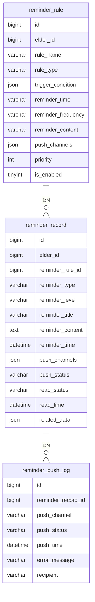

# 健康提醒与风险提示模块需求文档

## 功能概述

### 功能描述
健康提醒与风险提示模块根据录入规律、指标异常情况生成定期提醒，如持续高血压提示就医建议或复查提醒，帮助老年人及时关注健康问题。该模块支持多种提醒类型、灵活的提醒规则配置和多渠道的消息推送，确保提醒信息能够及时送达。

前端界面交互流程：
1. 用户进入提醒设置页面，查看已配置的提醒规则
2. 用户添加新的提醒规则，选择提醒类型、触发条件、提醒时间等
3. 用户查看提醒历史记录，了解已发送的提醒信息
4. 用户收到提醒通知后，点击查看详情
5. 用户可标记提醒为已读或忽略
6. 用户可查看健康风险提示，了解当前的健康风险

业务逻辑处理流程：
1. 系统定期扫描健康数据，检查是否满足提醒触发条件
2. 满足条件时，生成提醒记录
3. 根据提醒规则，选择合适的推送渠道（APP通知、短信、微信等）
4. 发送提醒消息
5. 记录提醒发送状态
6. 用户查看提醒后，更新提醒状态

与其他模块的交互流程：
- 依赖健康数据录入模块获取健康数据
- 依赖趋势可视化与统计分析模块获取健康状态分析结果
- 依赖多角色协同与服务模块向家属和医护人员推送提醒

### 功能范围
- **定期提醒**: 根据录入规律生成定期提醒（如每日测量血压提醒）
- **异常提醒**: 根据指标异常情况生成异常提醒（如血压偏高提醒）
- **复查提醒**: 根据健康状态生成复查提醒（如定期体检提醒）
- **就医建议**: 根据持续异常情况生成就医建议提醒
- **多渠道推送**: 支持APP通知、短信、微信等多种推送渠道
- **提醒管理**: 支持提醒规则的配置、查看、修改和删除
- **提醒历史**: 支持查看提醒历史记录和提醒状态

### 依赖关系
- **前置模块**: 健康数据录入模块、趋势可视化与统计分析模块
- **外部服务**: 短信服务、微信推送服务、APP推送服务
- **数据依赖**: 健康记录表、提醒规则表、提醒记录表

## 功能需求

### 核心功能列表

| 功能编号 | 功能名称 |
|---------|---------|
| F001 | 定期提醒 |
| F002 | 异常提醒 |
| F003 | 复查提醒 |
| F004 | 就医建议 |
| F005 | 多渠道推送 |
| F006 | 提醒规则管理 |
| F007 | 提醒历史查询 |

### 功能详细规格

#### F001: 定期提醒
**功能描述**: 根据录入规律生成定期提醒，提醒用户按时测量健康指标。

**关键逻辑思路**:
- 支持设置每日、每周、每月等定期提醒
- 支持设置具体的提醒时间（如每天早上8点）
- 支持设置提醒频率（如每天1次、每周3次）
- 支持设置提醒重复周期（如工作日、周末）
- 提醒内容可自定义（如"该测量血压了"）
- 支持临时取消或延迟提醒

**涉及的业务规则**:
- **规则1**: 定期提醒默认开启，用户可手动关闭
- **规则2**: 提醒时间默认为早上8点，用户可自定义
- **规则3**: 提醒频率根据指标类型自动设置（如血压每天1次，血糖每周3次）
- **规则4**: 用户连续3次忽略提醒后，自动降低提醒频率
- **规则5**: 用户连续3次按时测量后，自动提高提醒频率

#### F002: 异常提醒
**功能描述**: 根据指标异常情况生成异常提醒，提醒用户关注异常指标。

**关键逻辑思路**:
- 监控健康数据，检测异常指标
- 根据异常程度生成不同级别的提醒（轻度、中度、重度）
- 异常提醒包含异常指标名称、异常值、正常范围、建议措施
- 支持设置异常提醒的触发条件（如连续2次异常、单次严重异常）
- 支持设置异常提醒的发送频率（如每次异常都提醒、每天汇总提醒）

**涉及的业务规则**:
- **规则1**: 轻度异常（超出正常范围10%以内）生成轻度提醒
- **规则2**: 中度异常（超出正常范围10%-30%）生成中度提醒
- **规则3**: 重度异常（超出正常范围30%以上）生成重度提醒
- **规则4**: 连续2次轻度异常，生成中度提醒
- **规则5**: 单次重度异常，立即发送提醒

#### F003: 复查提醒
**功能描述**: 根据健康状态生成复查提醒，提醒用户定期进行体检或复查。

**关键逻辑思路**:
- 根据健康状态分析结果，生成复查提醒
- 支持设置复查周期（如每月、每季度、每半年、每年）
- 支持设置复查项目（如血压、血糖、血脂等）
- 提醒内容包含复查时间、复查项目、复查地点等
- 支持自定义复查提醒模板

**涉及的业务规则**:
- **规则1**: 健康状态良好，每半年提醒一次复查
- **规则2**: 健康状态正常，每季度提醒一次复查
- **规则3**: 健康状态警告，每月提醒一次复查
- **规则4**: 健康状态危险，每周提醒一次复查
- **规则5**: 复查提醒提前7天发送

#### F004: 就医建议
**功能描述**: 根据持续异常情况生成就医建议提醒，提醒用户及时就医。

**关键逻辑思路**:
- 监控健康数据，检测持续异常情况
- 根据异常持续时间和严重程度，生成就医建议提醒
- 就医建议包含异常情况描述、建议就医时间、建议就医科室等
- 支持设置就医建议的触发条件（如连续7天异常、连续3次重度异常）
- 支持关联附近的医院或医生信息

**涉及的业务规则**:
- **规则1**: 连续3天中度异常，生成就医建议提醒
- **规则2**: 连续7天轻度异常，生成就医建议提醒
- **规则3**: 连续3次重度异常，立即生成就医建议提醒
- **规则4**: 就医建议提醒包含紧急程度（普通、紧急、危急）
- **规则5**: 危急级别的就医建议提醒同时发送给家属和医护人员

#### F005: 多渠道推送
**功能描述**: 支持通过多种渠道推送提醒消息，确保提醒信息能够及时送达。

**关键逻辑思路**:
- 支持APP通知推送（应用内通知）
- 支持短信推送
- 支持微信推送（公众号或小程序）
- 支持邮件推送
- 支持根据提醒级别和用户偏好选择推送渠道
- 支持设置推送渠道的优先级

**涉及的业务规则**:
- **规则1**: 轻度提醒默认使用APP通知推送
- **规则2**: 中度提醒使用APP通知和短信推送
- **规则3**: 重度提醒使用APP通知、短信和微信推送
- **规则4**: 危急提醒使用所有可用渠道推送
- **规则5**: 用户可自定义推送渠道偏好

#### F006: 提醒规则管理
**功能描述**: 支持用户配置、查看、修改和删除提醒规则，满足个性化需求。

**关键逻辑思路**:
- 支持添加新的提醒规则
- 支持查看已配置的提醒规则列表
- 支持修改提醒规则（如提醒时间、提醒频率等）
- 支持删除提醒规则
- 支持启用或禁用提醒规则
- 支持导入和导出提醒规则

**涉及的业务规则**:
- **规则1**: 系统预置默认提醒规则，用户可自定义覆盖
- **规则2**: 提醒规则修改后立即生效
- **规则3**: 删除提醒规则后，不再生成对应的提醒
- **规则4**: 禁用的提醒规则不生成提醒，但保留规则配置
- **规则5**: 提醒规则修改记录日志，包括修改人、修改时间、修改内容

#### F007: 提醒历史查询
**功能描述**: 支持用户查看提醒历史记录，了解已发送的提醒信息和提醒状态。

**关键逻辑思路**:
- 支持按时间范围、提醒类型、提醒状态等条件查询提醒历史
- 列表展示提醒的关键信息：提醒时间、提醒类型、提醒内容、提醒状态等
- 支持查看提醒详情，包括完整的提醒内容和发送记录
- 支持标记提醒为已读或忽略
- 支持删除提醒历史记录

**涉及的业务规则**:
- **规则1**: 默认查询最近30天的提醒历史
- **规则2**: 列表按提醒时间倒序排列
- **规则3**: 已读的提醒标记为灰色，未读的提醒标记为红色
- **规则4**: 忽略的提醒不再重复发送
- **规则5**: 提醒历史记录保留1年，超过1年的记录自动归档

## 数据模型

### 数据库设计

#### 表结构设计

##### reminder_rule（提醒规则表）
| 字段名 | 数据类型 | 长度 | 约束 | 默认值 | 说明 |
|-------|---------|------|------|-------|------|
| id | BIGINT | - | PK, AUTO_INCREMENT | - | 主键ID |
| elder_id | BIGINT | - | NOT NULL | - | 老人ID |
| rule_name | VARCHAR | 100 | NOT NULL | - | 规则名称 |
| rule_type | VARCHAR | 20 | NOT NULL | - | 规则类型（PERIODIC-定期，ABNORMAL-异常，RECHECK-复查，MEDICAL-就医建议） |
| trigger_condition | JSON | - | NOT NULL | - | 触发条件 |
| reminder_time | VARCHAR | 50 | NULL | - | 提醒时间（如"08:00"） |
| reminder_frequency | VARCHAR | 50 | NULL | - | 提醒频率（如"每天1次"、"每周3次"） |
| reminder_content | VARCHAR | 500 | NOT NULL | - | 提醒内容 |
| push_channels | JSON | - | NOT NULL | - | 推送渠道（如["APP","SMS","WECHAT"]） |
| priority | INT | - | NOT NULL | 0 | 优先级（0-低，1-中，2-高） |
| is_enabled | TINYINT | - | NOT NULL | 1 | 是否启用（1-启用，0-禁用） |
| is_default | TINYINT | - | NOT NULL | 0 | 是否默认规则（1-是，0-否） |
| created_by | BIGINT | - | NOT NULL | - | 创建人ID |
| created_at | DATETIME | - | NOT NULL | CURRENT_TIMESTAMP | 创建时间 |
| updated_at | DATETIME | - | NOT NULL | CURRENT_TIMESTAMP | 更新时间 |

**索引设计**:
- PRIMARY KEY (id)
- INDEX idx_elder_id (elder_id)
- INDEX idx_rule_type (rule_type)
- INDEX idx_is_enabled (is_enabled)
- INDEX idx_priority (priority)

##### reminder_record（提醒记录表）
| 字段名 | 数据类型 | 长度 | 约束 | 默认值 | 说明 |
|-------|---------|------|------|-------|------|
| id | BIGINT | - | PK, AUTO_INCREMENT | - | 主键ID |
| elder_id | BIGINT | - | NOT NULL | - | 老人ID |
| reminder_rule_id | BIGINT | - | NULL | - | 提醒规则ID |
| reminder_type | VARCHAR | 20 | NOT NULL | - | 提醒类型 |
| reminder_level | VARCHAR | 20 | NOT NULL | - | 提醒级别（LOW-轻度，MEDIUM-中度，HIGH-重度，CRITICAL-危急） |
| reminder_title | VARCHAR | 200 | NOT NULL | - | 提醒标题 |
| reminder_content | TEXT | - | NOT NULL | - | 提醒内容 |
| reminder_time | DATETIME | - | NOT NULL | - | 提醒时间 |
| push_channels | JSON | - | NOT NULL | - | 推送渠道 |
| push_status | VARCHAR | 20 | NOT NULL | - | 推送状态（PENDING-待推送，SUCCESS-成功，FAILED-失败） |
| read_status | VARCHAR | 20 | NOT NULL | - | 阅读状态（UNREAD-未读，READ-已读，IGNORED-已忽略） |
| read_time | DATETIME | - | NULL | - | 阅读时间 |
| related_data | JSON | - | NULL | - | 关联数据（如异常指标信息） |
| created_at | DATETIME | - | NOT NULL | CURRENT_TIMESTAMP | 创建时间 |

**索引设计**:
- PRIMARY KEY (id)
- INDEX idx_elder_id (elder_id)
- INDEX idx_reminder_rule_id (reminder_rule_id)
- INDEX idx_reminder_type (reminder_type)
- INDEX idx_reminder_level (reminder_level)
- INDEX idx_push_status (push_status)
- INDEX idx_read_status (read_status)
- INDEX idx_reminder_time (reminder_time)

##### reminder_push_log（提醒推送日志表）
| 字段名 | 数据类型 | 长度 | 约束 | 默认值 | 说明 |
|-------|---------|------|------|-------|------|
| id | BIGINT | - | PK, AUTO_INCREMENT | - | 主键ID |
| reminder_record_id | BIGINT | - | NOT NULL | - | 提醒记录ID |
| push_channel | VARCHAR | 20 | NOT NULL | - | 推送渠道（APP-应用通知，SMS-短信，WECHAT-微信，EMAIL-邮件） |
| push_status | VARCHAR | 20 | NOT NULL | - | 推送状态（SUCCESS-成功，FAILED-失败） |
| push_time | DATETIME | - | NOT NULL | - | 推送时间 |
| error_message | VARCHAR | 500 | NULL | - | 错误信息 |
| recipient | VARCHAR | 100 | NULL | - | 接收人（如手机号、微信OpenID等） |
| created_at | DATETIME | - | NOT NULL | CURRENT_TIMESTAMP | 创建时间 |

**索引设计**:
- PRIMARY KEY (id)
- INDEX idx_reminder_record_id (reminder_record_id)
- INDEX idx_push_channel (push_channel)
- INDEX idx_push_status (push_status)
- INDEX idx_push_time (push_time)

#### 数据关系图

### 数据流图
1. 系统定期扫描健康数据 → 检查是否满足提醒触发条件 → 生成提醒记录 → 保存到reminder_record表
2. 根据提醒规则选择推送渠道 → 调用推送服务 → 记录推送日志 → 保存到reminder_push_log表
3. 用户查看提醒 → 更新提醒状态为已读 → 更新read_status和read_time
4. 用户忽略提醒 → 更新提醒状态为已忽略 → 更新read_status

## 接口设计

### API 概览

#### 需要的API列表

| 接口路径 | 方法 | 处理问题 | 权限要求 |
|---------|------|---------|---------|
| GET /api/v1/reminder/rules | GET | 获取提醒规则列表 | 所有角色 |
| POST /api/v1/reminder/rules | POST | 创建提醒规则 | 所有角色 |
| GET /api/v1/reminder/rules/{id} | GET | 获取提醒规则详情 | 所有角色 |
| PUT /api/v1/reminder/rules/{id} | PUT | 修改提醒规则 | 所有角色 |
| DELETE /api/v1/reminder/rules/{id} | DELETE | 删除提醒规则 | 所有角色 |
| POST /api/v1/reminder/rules/{id}/enable | POST | 启用提醒规则 | 所有角色 |
| POST /api/v1/reminder/rules/{id}/disable | POST | 禁用提醒规则 | 所有角色 |
| GET /api/v1/reminder/records | GET | 获取提醒记录列表 | 所有角色 |
| GET /api/v1/reminder/records/{id} | GET | 获取提醒记录详情 | 所有角色 |
| POST /api/v1/reminder/records/{id}/read | POST | 标记提醒为已读 | 所有角色 |
| POST /api/v1/reminder/records/{id}/ignore | POST | 忽略提醒 | 所有角色 |
| DELETE /api/v1/reminder/records/{id} | DELETE | 删除提醒记录 | 所有角色 |

##### GET /api/v1/reminder/rules
**接口功能简述**: 获取提醒规则列表
**关键处理逻辑**:
1. 接收查询参数（老人ID、规则类型、是否启用等）
2. 查询提醒规则表
3. 按优先级和创建时间排序
4. 返回规则列表
**注意事项**:
- 默认查询所有规则，包括启用和禁用的规则
- 用户只能查看自己的提醒规则
**权限控制（若需要）**: 老人只能查看自己的提醒规则，家属可查看关联老人的提醒规则，医护人员可查看负责老人的提醒规则

##### POST /api/v1/reminder/rules
**接口功能简述**: 创建新的提醒规则
**关键处理逻辑**:
1. 接收提醒规则参数
2. 校验规则参数的有效性
3. 创建提醒规则
4. 返回创建的规则信息
**注意事项**:
- 规则名称不能重复
- 触发条件必须符合规则类型的要求
- 推送渠道必须包含至少一个有效渠道
**权限控制（若需要）**: 老人只能创建自己的提醒规则，家属可创建关联老人的提醒规则，医护人员可创建负责老人的提醒规则

##### GET /api/v1/reminder/rules/{id}
**接口功能简述**: 获取指定提醒规则的详细信息
**关键处理逻辑**:
1. 根据ID查询提醒规则
2. 返回规则的详细信息
**注意事项**:
- 如果规则不存在，返回404错误
**权限控制（若需要）**: 老人只能查看自己的提醒规则，家属可查看关联老人的提醒规则，医护人员可查看负责老人的提醒规则

##### PUT /api/v1/reminder/rules/{id}
**接口功能简述**: 修改指定的提醒规则
**关键处理逻辑**:
1. 校验提醒规则是否存在
2. 接收修改参数
3. 校验修改参数的有效性
4. 更新提醒规则
5. 记录修改日志
6. 返回更新后的规则信息
**注意事项**:
- 规则修改后立即生效
- 默认规则不能修改为自定义规则
**权限控制（若需要）**: 老人只能修改自己的提醒规则，家属可修改关联老人的提醒规则，医护人员可修改负责老人的提醒规则

##### DELETE /api/v1/reminder/rules/{id}
**接口功能简述**: 删除指定的提醒规则
**关键处理逻辑**:
1. 校验提醒规则是否存在
2. 删除提醒规则
3. 返回删除结果
**注意事项**:
- 默认规则不能删除，只能禁用
- 删除后不再生成对应的提醒
**权限控制（若需要）**: 老人只能删除自己的提醒规则，家属可删除关联老人的提醒规则，医护人员可删除负责老人的提醒规则

##### POST /api/v1/reminder/rules/{id}/enable
**接口功能简述**: 启用指定的提醒规则
**关键处理逻辑**:
1. 校验提醒规则是否存在
2. 更新规则状态为启用
3. 返回操作结果
**注意事项**:
- 启用后立即开始生成提醒
**权限控制（若需要）**: 老人只能启用自己的提醒规则，家属可启用关联老人的提醒规则，医护人员可启用负责老人的提醒规则

##### POST /api/v1/reminder/rules/{id}/disable
**接口功能简述**: 禁用指定的提醒规则
**关键处理逻辑**:
1. 校验提醒规则是否存在
2. 更新规则状态为禁用
3. 返回操作结果
**注意事项**:
- 禁用后不再生成提醒，但保留规则配置
**权限控制（若需要）**: 老人只能禁用自己的提醒规则，家属可禁用关联老人的提醒规则，医护人员可禁用负责老人的提醒规则

##### GET /api/v1/reminder/records
**接口功能简述**: 获取提醒记录列表
**关键处理逻辑**:
1. 接收查询参数（老人ID、提醒类型、提醒状态、时间范围等）
2. 查询提醒记录表
3. 按提醒时间倒序排列
4. 支持分页查询
5. 返回记录列表
**注意事项**:
- 默认查询最近30天的提醒记录
- 用户只能查看自己的提醒记录
**权限控制（若需要）**: 老人只能查看自己的提醒记录，家属可查看关联老人的提醒记录，医护人员可查看负责老人的提醒记录

##### GET /api/v1/reminder/records/{id}
**接口功能简述**: 获取指定提醒记录的详细信息
**关键处理逻辑**:
1. 根据ID查询提醒记录
2. 查询关联的推送日志
3. 返回记录的详细信息
**注意事项**:
- 如果记录不存在，返回404错误
**权限控制（若需要）**: 老人只能查看自己的提醒记录，家属可查看关联老人的提醒记录，医护人员可查看负责老人的提醒记录

##### POST /api/v1/reminder/records/{id}/read
**接口功能简述**: 标记提醒为已读
**关键处理逻辑**:
1. 校验提醒记录是否存在
2. 更新提醒状态为已读
3. 记录阅读时间
4. 返回操作结果
**注意事项**:
- 已读的提醒标记为灰色
**权限控制（若需要）**: 老人只能标记自己的提醒为已读，家属可标记关联老人的提醒为已读，医护人员可标记负责老人的提醒为已读

##### POST /api/v1/reminder/records/{id}/ignore
**接口功能简述**: 忽略提醒
**关键处理逻辑**:
1. 校验提醒记录是否存在
2. 更新提醒状态为已忽略
3. 返回操作结果
**注意事项**:
- 忽略的提醒不再重复发送
**权限控制（若需要）**: 老人只能忽略自己的提醒，家属可忽略关联老人的提醒，医护人员可忽略负责老人的提醒

##### DELETE /api/v1/reminder/records/{id}
**接口功能简述**: 删除指定的提醒记录
**关键处理逻辑**:
1. 校验提醒记录是否存在
2. 删除提醒记录和关联的推送日志
3. 返回删除结果
**注意事项**:
- 删除操作不可恢复
**权限控制（若需要）**: 老人只能删除自己的提醒记录，家属可删除关联老人的提醒记录，医护人员可删除负责老人的提醒记录

**API文档说明**: 具体的请求参数、响应格式、错误码等细节请参考 Swagger 文档。

### 架构设计
模块采用分层架构设计：
- **表现层**: 负责前端页面展示和用户交互，使用鸿蒙ArkTS开发移动端界面
- **接口层**: 提供RESTful API接口，处理HTTP请求和响应
- **业务逻辑层**: 实现提醒生成、提醒推送、提醒管理等核心逻辑
- **任务调度层**: 使用定时任务定期扫描健康数据，生成提醒
- **推送服务层**: 封装多种推送渠道的调用（APP通知、短信、微信、邮件等）
- **数据访问层**: 负责数据库操作，使用ORM框架简化数据访问
- **数据层**: MySQL数据库存储提醒规则、提醒记录和推送日志

### 关键技术点
1. **定时任务**: 使用定时任务定期扫描健康数据，检查是否满足提醒触发条件
2. **多渠道推送**: 封装多种推送渠道的调用，支持APP通知、短信、微信、邮件等
3. **提醒规则引擎**: 实现灵活的提醒规则配置和触发条件判断
4. **消息队列**: 使用消息队列异步处理提醒推送，提高系统性能
5. **推送失败重试**: 对推送失败的提醒进行重试，确保提醒信息能够送达
6. **提醒去重**: 对重复的提醒进行去重处理，避免重复推送

### 性能优化策略
- **异步处理**: 提醒推送采用异步处理，使用消息队列解耦
- **批量推送**: 对多个提醒进行批量推送，减少网络请求次数
- **缓存策略**: 对提醒规则进行缓存，减少数据库查询
- **索引优化**: 在elder_id、reminder_rule_id、reminder_type、reminder_time等常用查询字段上建立索引
- **分页查询**: 列表查询支持分页，避免一次性加载大量数据
- **定期归档**: 对超过1年的提醒记录进行归档，减少主表数据量
