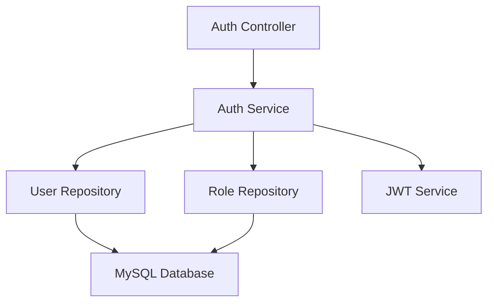

# 用户注册功能需求文档

## 功能概述

### 功能描述
用户注册功能为老年人健康档案管理平台提供新用户接入能力，支持老人、家属、医护人员三种角色的注册流程。用户通过手机号或邮箱直接注册，设置登录密码，系统自动分配默认角色权限，引导用户完成基础信息录入。

### 功能范围
- 手机号注册：支持通过手机号+密码方式注册
- 邮箱注册：支持通过邮箱+密码方式注册
- 角色选择：注册时选择用户角色（老人/家属/医护人员）
- 密码设置：支持设置登录密码并进行强度校验
- 基础信息录入：注册后引导用户完善姓名、性别等基础信息

### 依赖关系
- **前置模块**: 无（作为基础模块）
- **外部服务**: 无
- **数据依赖**: 用户表、角色表

## 功能需求

### 核心功能列表

| 功能编号 | 功能名称 | 优先级 | 复杂度 | 状态 |
|---------|---------|-------|-------|------|
| F001 | 手机号注册 | 高 | 低 | 待开发 |
| F002 | 邮箱注册 | 中 | 低 | 待开发 |
| F003 | 密码强度校验 | 高 | 低 | 待开发 |
| F004 | 角色选择与分配 | 高 | 低 | 待开发 |
| F005 | 基础信息引导录入 | 中 | 中 | 待开发 |

### 功能详细规格

#### F001: 手机号注册
**功能描述**: 支持用户通过手机号+密码方式完成注册，确保手机号的唯一性。

**关键逻辑思路**:
- 用户输入手机号后，系统校验手机号格式是否正确
- 用户设置登录密码，系统进行密码强度校验
- 用户选择注册角色（老人/家属/医护人员）
- 注册成功后，创建用户记录并分配默认角色权限
- 返回JWT token，自动登录并跳转到首页或信息完善页

**涉及的业务规则**:
- 手机号唯一性规则：同一手机号只能注册一个账号
- 密码强度规则：至少8位，包含字母和数字
- 角色规则：注册时必须选择一个角色

#### F002: 邮箱注册
**功能描述**: 支持用户通过邮箱+密码方式完成注册，提供除手机号外的另一种注册方式。

**关键逻辑思路**:
- 用户输入邮箱后，系统校验邮箱格式是否正确
- 用户设置登录密码，系统进行密码强度校验
- 用户选择注册角色（老人/家属/医护人员）
- 后续流程与手机号注册一致

**涉及的业务规则**:
- 邮箱唯一性规则：同一邮箱只能注册一个账号

#### F003: 密码强度校验
**功能描述**: 对用户设置的密码进行强度校验，确保账号安全性。

**关键逻辑思路**:
- 校验密码长度是否至少8位
- 校验密码是否同时包含字母和数字
- 校验密码是否包含特殊字符（可选，增强安全性）
- 校验密码是否包含用户名或手机号（防止弱密码）
- 返回密码强度等级和提示信息

**涉及的业务规则**:
- 最低强度规则：至少8位，包含字母和数字
- 推荐强度规则：至少10位，包含字母、数字和特殊字符
- 禁止规则：不能包含用户名、手机号、连续数字（如123456）

#### F004: 角色选择与分配
**功能描述**: 注册时提供角色选择功能，根据选择的角色自动分配对应的默认权限。

**关键逻辑思路**:
- 提供角色选择列表：老人、家属、医护人员
- 用户选择角色后，系统查询该角色的默认权限
- 创建用户记录时，建立用户-角色关联关系

**涉及的业务规则**:
- 角色默认权限规则：每个角色有预定义的默认权限集
- 角色唯一性规则：一个用户初始只能有一个角色，后续可通过管理员分配多个角色

#### F005: 基础信息引导录入
**功能描述**: 注册成功后引导用户完善基础信息，为后续功能使用提供必要数据。

**关键逻辑思路**:
- 注册成功后跳转到信息完善页面
- 根据用户角色显示不同的必填字段
- 老人角色：姓名、性别、出生日期、紧急联系人
- 家属角色：姓名、性别、与老人关系
- 医护人员角色：姓名、性别、所属医疗机构、执业证号
- 用户可以选择跳过，后续在个人中心完善

**涉及的业务规则**:
- 必填字段规则：根据角色定义不同的必填字段
- 数据格式规则：日期格式、手机号格式等
- 跳过规则：允许用户跳过信息完善，但部分功能可能受限

## 前端交互设计

### 大致交互流程

#### 注册流程
```
用户打开注册页面
    ↓
选择注册角色（老人/家属/医护人员）
    ↓
输入手机号或邮箱
    ↓
设置登录密码
    ↓
确认密码
    ↓
点击"立即注册"
    ↓
系统校验所有输入
    ↓
注册成功，跳转到信息完善页面
    ↓
用户完善信息或跳过
    ↓
跳转到对应角色的首页
```

## 数据模型

### 数据库设计

当前项目数据库已包含完整的用户和角色管理表结构，可以完全支持注册功能实现：

- **users表**：存储用户基本信息，包含username、password、email、phone、real_name、status等字段
- **roles表**：存储角色信息，包含role_code、role_name、description、level等字段
- **user_roles表**：存储用户角色关联关系
- **elder_basic_info表**：存储老人详细信息，包含name、gender、birth_date、emergency_contact等字段

以上表结构已满足注册功能的所有需求，无需额外设计。

### 数据流图
用户输入注册信息 → 前端校验 → 调用注册API → 后端校验 → 检查用户是否存在 → 创建用户记录 → 分配角色 → 生成JWT Token → 返回注册成功 → 跳转到信息完善页

## 接口设计

### API 概览

#### 主要API列表

| 接口路径 | 方法 | 处理问题 | 权限要求 |
|---------|------|---------|---------|
| POST /api/v1/auth/register | POST | 用户注册 | 无 |
| POST /api/v1/auth/check-phone-email | POST | 检查手机号/邮箱是否已注册 | 无 |

#### API 关键逻辑

##### POST /api/v1/auth/register
**接口功能简述**: 处理用户注册请求，创建用户账号并分配默认角色
**关键处理逻辑**:
1. 接收注册信息：手机号/邮箱、密码、角色
2. 校验手机号/邮箱格式是否正确
3. 检查手机号/邮箱是否已被注册
4. 校验密码强度是否符合要求
5. 对密码进行哈希加密（使用bcrypt）
6. 创建用户记录到数据库
7. 根据选择的角色，查询角色ID并创建用户-角色关联
8. 生成JWT Token，包含用户ID和角色信息
9. 返回注册成功信息和Token

**注意事项**:
- 密码必须加密存储，不能明文存储
- 医护人员角色可能需要设置为待审核状态

**权限控制（若需要）**: 无需登录

##### POST /api/v1/auth/check-phone-email
**接口功能简述**: 检查手机号或邮箱是否已被注册，用于前端实时提示
**关键处理逻辑**:
1. 接收手机号或邮箱
2. 查询数据库中是否存在该手机号或邮箱
3. 返回是否存在的结果

**注意事项**:
- 该接口容易被恶意调用，需要频率限制
- 返回结果时不要泄露用户信息

**权限控制（若需要）**: 无需登录，但需要IP频率限制

### 架构设计
采用分层架构设计，包括Controller层、Service层、Repository层。



### 关键技术点
1. **密码加密**: 使用bcrypt算法对密码进行哈希加密，盐值自动生成
2. **JWT Token**: 使用jsonwebtoken库生成和验证JWT Token

### 性能优化策略
- **连接池**: 数据库使用连接池，提高并发性能

### 安全实现
- **密码加密**: 使用bcrypt加密密码，不可逆
- **输入校验**: 对所有输入参数进行严格校验，防止SQL注入和XSS攻击
- **HTTPS**: 生产环境必须使用HTTPS传输
