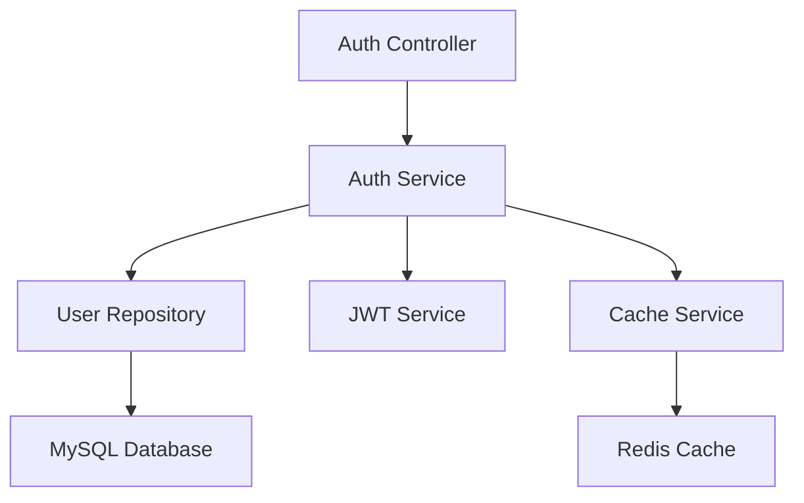

# 用户登录功能需求文档

## 功能概述

### 功能描述
用户登录功能为老年人健康档案管理平台提供身份认证能力，支持密码登录方式。登录成功后生成JWT Token，用于后续API请求的身份验证。系统根据用户角色跳转到对应的首页，提供差异化的功能展示。

### 功能范围
- 密码登录：支持手机号/邮箱+密码方式登录
- 退出登录：支持安全退出登录
- Token刷新：支持Token刷新机制
- 登录状态管理：管理用户的登录状态

### 依赖关系
- **前置模块**: 用户注册模块
- **外部服务**: 无
- **数据依赖**: 用户表、角色表、用户角色关联表

## 功能需求

### 核心功能列表

| 功能编号 | 功能名称 | 优先级 | 复杂度 | 状态 |
|---------|---------|-------|-------|------|
| F001 | 密码登录 | 高 | 低 | 待开发 |
| F002 | 退出登录 | 高 | 低 | 待开发 |
| F003 | Token刷新 | 高 | 中 | 待开发 |
| F004 | 登录状态管理 | 高 | 中 | 待开发 |

### 功能详细规格

#### F001: 密码登录
**功能描述**: 支持用户通过手机号/邮箱+密码方式登录，验证用户身份并生成访问令牌。

**关键逻辑思路**:
- 用户输入手机号或邮箱和密码
- 系统校验手机号/邮箱格式是否正确
- 查询数据库中是否存在该用户
- 检查用户状态是否正常（未被禁用）
- 使用bcrypt比对密码哈希值
- 验证成功后，生成JWT Token
- 更新用户最后登录时间和IP
- 返回Token和用户信息（包括角色）
- 前端根据用户角色跳转到对应首页

**涉及的业务规则**:
- 账号状态规则：只有状态为"正常"的用户才能登录
- 密码错误规则：连续5次密码错误锁定账号30分钟
- Token有效期规则：Access Token有效期2小时，Refresh Token有效期7天

#### F002: 退出登录
**功能描述**: 支持用户安全退出登录，清除本地Token和用户信息。

**关键逻辑思路**:
- 用户点击退出登录
- 前端清除本地存储的Token和用户信息
- 调用后端退出登录API（可选，用于使Token失效）
- 跳转到登录页面
- 清除所有缓存数据

**涉及的业务规则**:
- Token失效规则：退出登录后，Token应该失效（可选，使用黑名单机制）
- 缓存清理规则：清除所有用户相关的本地缓存

#### F003: Token刷新
**功能描述**: 当Access Token即将过期时，使用Refresh Token获取新的Access Token，避免用户频繁重新登录。

**关键逻辑思路**:
- 前端在Access Token过期前（如剩余5分钟）调用刷新接口
- 后端验证Refresh Token是否有效且未过期
- 验证通过后，生成新的Access Token
- 可选：同时生成新的Refresh Token（滚动刷新）
- 返回新的Access Token和Refresh Token
- 前端更新本地存储的Token

**涉及的业务规则**:
- Refresh Token有效期规则：7天
- 刷新频率规则：Access Token剩余5分钟内才能刷新
- 滚动刷新规则：每次刷新后生成新的Refresh Token，旧的失效

#### F004: 登录状态管理
**功能描述**: 管理用户的登录状态，包括Token存储、自动登录、登录过期处理等。

**关键逻辑思路**:
- 登录成功后，将Token和用户信息存储到本地（如localStorage或Preferences）
- 每次API请求时，在请求头中携带Token
- 后端中间件验证Token有效性
- Token过期时，自动调用刷新接口
- 刷新失败时，跳转到登录页面
- 提供"记住我"功能，延长Token有效期

**涉及的业务规则**:
- Token存储规则：Access Token和Refresh Token分开存储
- 自动登录规则：勾选"记住我"后，Refresh Token有效期延长到30天
- 过期处理规则：Token过期后自动刷新，刷新失败跳转登录页

## 前端交互设计

### 大致界面设计

#### 登录页面
```
┌─────────────────────────────────┐
│      老年人健康档案管理平台      │
├─────────────────────────────────┤
│                                 │
│   欢迎回来                      │
│                                 │
│   手机号/邮箱                   │
│   [_________________________]   │
│                                 │
│   密码                          │
│   [_________________________]   │
│   [显示/隐藏]                   │
│                                 │
│   [记住我]                      │
│                                 │
│   [   立即登录   ]              │
│                                 │
│   还没有账号？[立即注册]        │
│                                 │
└─────────────────────────────────┘
```

### 大致交互流程

#### 密码登录流程
```
用户打开登录页面
    ↓
输入手机号/邮箱和密码
    ↓
选择是否"记住我"
    ↓
点击"立即登录"
    ↓
前端校验输入格式
    ↓
调用登录API
    ↓
后端验证用户身份
    ↓
生成JWT Token
    ↓
返回Token和用户信息
    ↓
前端存储Token和用户信息
    ↓
根据用户角色跳转到对应首页
```

#### Token刷新流程
```
前端发起API请求
    ↓
后端返回Token过期错误
    ↓
前端捕获错误
    ↓
调用Token刷新API
    ↓
后端验证Refresh Token
    ↓
生成新的Access Token
    ↓
返回新的Token
    ↓
前端更新本地Token
    ↓
重新发起原API请求
```

## 数据模型

### 数据库设计

当前项目数据库已包含完整的用户和角色管理表结构，可以完全支持登录功能实现：

- **users表**：存储用户基本信息，包含username、password、email、phone、real_name、status、last_login_at、last_login_ip等字段
- **roles表**：存储角色信息，包含role_code、role_name、description、level等字段
- **user_roles表**：存储用户角色关联关系

以上表结构已满足登录功能的所有需求，无需额外设计。

**注意**：文档中提到的token_blacklist表为可选功能，用于实现退出登录时使Token失效，当前数据库暂未包含此表，可根据实际需求决定是否实现。

### 数据流图
用户输入登录信息 → 前端校验 → 调用登录API → 后端验证用户身份 → 生成JWT Token → 返回Token和用户信息 → 前端存储Token → 跳转到对应角色首页

## 接口设计

### API 概览

#### 主要API列表

| 接口路径 | 方法 | 处理问题 | 权限要求 |
|---------|------|---------|---------|
| POST /api/v1/auth/login | POST | 密码登录 | 无 |
| POST /api/v1/auth/logout | POST | 退出登录 | 需要登录 |
| POST /api/v1/auth/refresh-token | POST | 刷新Token | 无（使用Refresh Token） |
| GET /api/v1/auth/me | GET | 获取当前用户信息 | 需要登录 |

#### API 关键逻辑

##### POST /api/v1/auth/login
**接口功能简述**: 处理密码登录请求，验证用户身份并生成访问令牌
**关键处理逻辑**:
1. 接收登录信息：手机号/邮箱、密码、是否记住我
2. 校验手机号/邮箱格式是否正确
3. 查询数据库中是否存在该用户
4. 检查用户状态是否正常（status=1）
5. 检查账号是否被锁定（连续5次密码错误）
6. 使用bcrypt比对密码哈希值
7. 密码错误时，增加错误次数，达到5次则锁定30分钟
8. 密码正确时，重置错误次数
9. 生成Access Token（有效期2小时）
10. 生成Refresh Token（有效期7天，如果勾选"记住我"则为30天）
11. 更新用户最后登录时间和IP
12. 返回Token和用户信息（包括角色、权限）

**注意事项**:
- 密码错误次数需要存储在Redis中，设置30分钟过期
- 登录成功后需要清除密码错误次数
- Token中不要包含敏感信息（如密码）
- 返回用户信息时不要返回密码哈希等敏感字段

**权限控制（若需要）**: 无需登录

##### POST /api/v1/auth/logout
**接口功能简述**: 处理退出登录请求，使Token失效（可选）
**关键处理逻辑**:
1. 从请求头获取JWT Token
2. 解析Token获取用户信息
3. 将Token加入黑名单（可选）
4. 返回退出成功

**注意事项**:
- 如果使用黑名单机制，需要将Token的jti（JWT ID）加入黑名单
- 黑名单需要设置过期时间，与Token过期时间一致
- 如果不使用黑名单机制，前端清除Token即可

**权限控制（若需要）**: 需要登录

##### POST /api/v1/auth/refresh-token
**接口功能简述**: 使用Refresh Token获取新的Access Token
**关键处理逻辑**:
1. 接收Refresh Token
2. 验证Refresh Token是否有效且未过期
3. 解析Token获取用户ID
4. 检查Refresh Token是否在黑名单中（可选）
5. 生成新的Access Token
6. 可选：生成新的Refresh Token（滚动刷新）
7. 返回新的Token

**注意事项**:
- Refresh Token应该比Access Token有更长的有效期
- 如果使用滚动刷新，每次刷新后旧的Refresh Token应该失效
- 需要防止Refresh Token被滥用，可以限制刷新次数

**权限控制（若需要）**: 无需登录（使用Refresh Token）

##### GET /api/v1/auth/me
**接口功能简述**: 获取当前登录用户的详细信息
**关键处理逻辑**:
1. 从请求头获取JWT Token
2. 解析Token获取用户ID
3. 查询数据库获取用户详细信息
4. 查询用户的角色和权限
5. 返回用户信息（包括角色、权限）

**注意事项**:
- 不要返回敏感信息（如密码哈希）
- 返回的用户信息应该包含角色和权限，便于前端权限控制

**权限控制（若需要）**: 需要登录

### 架构设计
采用分层架构设计，包括Controller层、Service层、Repository层。



### 关键技术点
1. **JWT Token**: 使用jsonwebtoken库生成和验证JWT Token
2. **密码比对**: 使用bcrypt.compare比对密码哈希值
3. **Token刷新**: 实现Access Token和Refresh Token双Token机制
4. **登录限流**: 使用Redis实现密码错误次数限制和账号锁定
5. **Token黑名单**: 可选，使用Redis存储失效的Token

### 性能优化策略
- **Token缓存**: 可选，将用户权限信息缓存到Redis，减少数据库查询
- **密码错误缓存**: 使用Redis存储密码错误次数，避免频繁查询数据库
- **连接池**: 数据库和Redis使用连接池，提高并发性能

### 安全实现
- **密码加密**: 使用bcrypt加密密码，不可逆
- **JWT签名**: 使用强密钥签名JWT Token，防止伪造
- **Token过期**: 设置合理的Token过期时间，定期刷新
- **登录限流**: 防止暴力破解，设置密码错误次数限制
- **HTTPS**: 生产环境必须使用HTTPS传输
