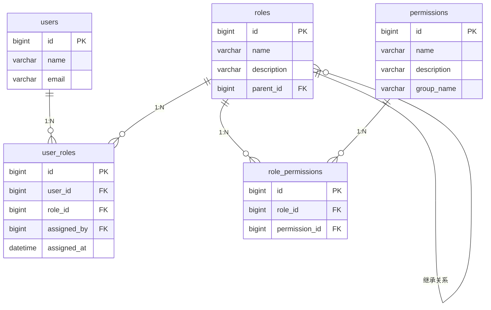
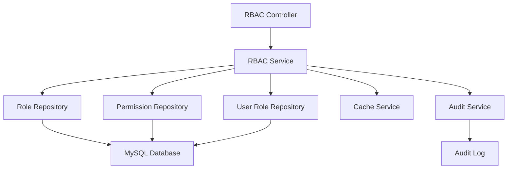

# RBAC功能需求文档

## 功能概述

### 功能描述
基于角色访问控制(RBAC)的权限管理系统，为老年人健康档案管理平台提供完整的用户角色管理、权限分配和访问控制功能。该模块通过角色-权限的映射关系，实现细粒度的权限控制，确保不同用户角色只能访问其职责范围内的数据和功能。

### 功能范围
- 用户角色管理：支持多角色体系，包括老人、家属、医护人员、管理员等
- 权限模型设计：基于RBAC模型实现权限分配和验证
- 角色权限映射：灵活配置角色与权限的关联关系
- 权限验证机制：在API层面和前端界面层面进行权限控制
- 角色层级管理：支持角色继承和权限累积

### 依赖关系
- **前置模块**: 无（作为基础模块）
- **外部服务**: 无
- **数据依赖**: 用户基本信息数据

## 功能需求

### 核心功能列表

| 功能编号 | 功能名称 | 优先级 | 复杂度 | 状态 |
|---------|---------|-------|-------|------|
| F001 | 角色管理 | 高 | 中 | 待开发 |
| F002 | 权限管理 | 高 | 中 | 待开发 |
| F003 | 用户角色分配 | 高 | 低 | 待开发 |
| F004 | 权限验证中间件 | 高 | 高 | 待开发 |
| F005 | 角色权限映射 | 高 | 中 | 待开发 |
| F006 | 权限检查工具 | 中 | 低 | 待开发 |

### 功能详细规格

#### F001: 角色管理
**功能描述**: 提供角色创建、编辑、删除和查询功能，支持角色层级结构和权限继承。

**输入参数**:
| 参数名 | 类型 | 必填 | 格式要求 | 说明 |
|-------|------|------|---------|------|
| name | String | 是 | 2-50字符，中英文数字下划线 | 角色名称 |
| description | String | 否 | 最大200字符 | 角色描述 |
| parent_id | Number | 否 | 有效角色ID | 父角色ID，用于继承 |
| permissions | Array | 否 | 权限ID数组 | 直接分配的权限列表 |

**输出结果**:
| 字段名 | 类型 | 说明 |
|-------|------|------|
| id | Number | 角色ID |
| name | String | 角色名称 |
| description | String | 角色描述 |
| parent_id | Number | 父角色ID |
| permissions | Array | 权限列表 |
| created_at | Date | 创建时间 |
| updated_at | Date | 更新时间 |

**处理流程**:
1. 验证角色名称唯一性
2. 检查父角色是否存在（如果提供）
3. 创建角色记录
4. 建立角色-权限关联关系
5. 返回创建结果

**异常处理**:
- **错误码 E001**: 角色名称已存在 - 返回角色冲突错误
- **错误码 E002**: 父角色不存在 - 返回无效参数错误
- **错误码 E003**: 权限ID无效 - 返回参数验证错误

#### F002: 权限管理
**功能描述**: 管理系统中的所有权限项，支持权限的分组管理和描述。

**输入参数**:
| 参数名 | 类型 | 必填 | 格式要求 | 说明 |
|-------|------|------|---------|------|
| name | String | 是 | 2-100字符，英文冒号分隔 | 权限标识，如"health_record:read" |
| description | String | 是 | 最大200字符 | 权限描述 |
| group | String | 是 | 2-50字符 | 权限分组，如"档案管理" |
| resource | String | 否 | 最大100字符 | 关联的资源类型 |

**输出结果**:
| 字段名 | 类型 | 说明 |
|-------|------|------|
| id | Number | 权限ID |
| name | String | 权限标识 |
| description | String | 权限描述 |
| group | String | 权限分组 |
| resource | String | 资源类型 |

**处理流程**:
1. 验证权限标识格式和唯一性
2. 创建权限记录
3. 返回权限信息

**异常处理**:
- **错误码 E004**: 权限标识已存在 - 返回权限冲突错误
- **错误码 E005**: 权限标识格式无效 - 返回参数验证错误

#### F003: 用户角色分配
**功能描述**: 为用户分配角色，支持单个用户多角色配置。

**输入参数**:
| 参数名 | 类型 | 必填 | 格式要求 | 说明 |
|-------|------|------|---------|------|
| user_id | Number | 是 | 有效用户ID | 用户ID |
| role_ids | Array | 是 | 角色ID数组，至少一个 | 要分配的角色列表 |

**输出结果**:
| 字段名 | 类型 | 说明 |
|-------|------|------|
| user_id | Number | 用户ID |
| roles | Array | 用户角色列表 |
| permissions | Array | 用户拥有的所有权限（含继承） |

**处理流程**:
1. 验证用户存在性
2. 验证角色ID有效性
3. 清除用户现有角色分配
4. 建立新的用户-角色关联
5. 计算用户最终权限（含角色继承）
6. 返回分配结果

**异常处理**:
- **错误码 E006**: 用户不存在 - 返回用户不存在错误
- **错误码 E007**: 角色ID无效 - 返回参数验证错误

#### F004: 权限验证中间件
**功能描述**: Koa中间件，在API请求层面进行权限验证，支持多种验证模式。

**输入参数**:
| 参数名 | 类型 | 必填 | 格式要求 | 说明 |
|-------|------|------|---------|------|
| required_permissions | Array | 否 | 权限标识数组 | 需要的权限列表 |
| require_all | Boolean | 否 | true/false | 是否需要所有权限，默认false（任一权限即可） |
| user_id | Number | 是 | 从JWT token解析 | 当前用户ID |

**输出结果**:
| 字段名 | 类型 | 说明 |
|-------|------|------|
| authorized | Boolean | 是否授权通过 |
| user_permissions | Array | 用户权限列表 |
| missing_permissions | Array | 缺失的权限列表 |

**处理流程**:
1. 从请求头获取JWT token
2. 解析token获取用户信息
3. 查询用户角色和权限
4. 检查用户是否拥有所需权限
5. 根据验证结果决定是否继续请求或返回权限错误

**异常处理**:
- **错误码 E008**: Token无效或过期 - 返回认证错误
- **错误码 E009**: 用户权限不足 - 返回权限拒绝错误

#### F005: 角色权限映射
**功能描述**: 管理角色与权限的关联关系，支持批量操作。

**输入参数**:
| 参数名 | 类型 | 必填 | 格式要求 | 说明 |
|-------|------|------|---------|------|
| role_id | Number | 是 | 有效角色ID | 角色ID |
| permission_ids | Array | 是 | 权限ID数组 | 要关联的权限列表 |
| operation | String | 是 | "add"/"remove"/"replace" | 操作类型 |

**输出结果**:
| 字段名 | 类型 | 说明 |
|-------|------|------|
| role_id | Number | 角色ID |
| permissions | Array | 角色当前权限列表 |

**处理流程**:
1. 验证角色存在性
2. 根据操作类型执行相应的权限关联操作
3. 确保权限关联关系的一致性
4. 返回更新后的权限列表

**异常处理**:
- **错误码 E010**: 角色不存在 - 返回角色不存在错误
- **错误码 E011**: 权限ID无效 - 返回参数验证错误

#### F006: 权限检查工具
**功能描述**: 提供权限检查的工具函数，支持前端和后端调用。

**输入参数**:
| 参数名 | 类型 | 必填 | 格式要求 | 说明 |
|-------|------|------|---------|------|
| user_id | Number | 是 | 有效用户ID | 用户ID |
| permission | String | 是 | 权限标识 | 要检查的权限 |
| resource_id | Number | 否 | 资源ID | 特定资源ID（如老人档案ID） |

**输出结果**:
| 字段名 | 类型 | 说明 |
|-------|------|------|
| has_permission | Boolean | 是否拥有权限 |
| permission_details | Object | 权限详细信息 |

**处理流程**:
1. 查询用户角色
2. 获取用户权限列表
3. 检查特定权限是否存在
4. 返回检查结果

**异常处理**:
- **错误码 E012**: 用户不存在 - 返回用户不存在错误

## 数据模型

### 数据库设计

#### 表结构设计

##### roles（角色表）
| 字段名 | 数据类型 | 长度 | 约束 | 默认值 | 说明 |
|-------|---------|------|------|-------|------|
| id | BIGINT | - | PK, AUTO_INCREMENT | - | 主键ID |
| name | VARCHAR | 50 | NOT NULL, UNIQUE | - | 角色名称 |
| description | VARCHAR | 200 | - | - | 角色描述 |
| parent_id | BIGINT | - | FK | NULL | 父角色ID |
| created_at | DATETIME | - | NOT NULL | CURRENT_TIMESTAMP | 创建时间 |
| updated_at | DATETIME | - | NOT NULL | CURRENT_TIMESTAMP | 更新时间 |

**索引设计**:
- PRIMARY KEY (id)
- UNIQUE KEY uk_name (name)
- INDEX idx_parent_id (parent_id)
- INDEX idx_created_at (created_at)

##### permissions（权限表）
| 字段名 | 数据类型 | 长度 | 约束 | 默认值 | 说明 |
|-------|---------|------|------|-------|------|
| id | BIGINT | - | PK, AUTO_INCREMENT | - | 主键ID |
| name | VARCHAR | 100 | NOT NULL, UNIQUE | - | 权限标识 |
| description | VARCHAR | 200 | NOT NULL | - | 权限描述 |
| group_name | VARCHAR | 50 | NOT NULL | - | 权限分组 |
| resource_type | VARCHAR | 100 | - | NULL | 资源类型 |
| created_at | DATETIME | - | NOT NULL | CURRENT_TIMESTAMP | 创建时间 |
| updated_at | DATETIME | - | NOT NULL | CURRENT_TIMESTAMP | 更新时间 |

**索引设计**:
- PRIMARY KEY (id)
- UNIQUE KEY uk_name (name)
- INDEX idx_group_name (group_name)
- INDEX idx_resource_type (resource_type)

##### user_roles（用户角色关联表）
| 字段名 | 数据类型 | 长度 | 约束 | 默认值 | 说明 |
|-------|---------|------|------|-------|------|
| id | BIGINT | - | PK, AUTO_INCREMENT | - | 主键ID |
| user_id | BIGINT | - | NOT NULL, FK | - | 用户ID |
| role_id | BIGINT | - | NOT NULL, FK | - | 角色ID |
| assigned_by | BIGINT | - | NOT NULL, FK | - | 分配人用户ID |
| assigned_at | DATETIME | - | NOT NULL | CURRENT_TIMESTAMP | 分配时间 |

**索引设计**:
- PRIMARY KEY (id)
- UNIQUE KEY uk_user_role (user_id, role_id)
- INDEX idx_user_id (user_id)
- INDEX idx_role_id (role_id)
- INDEX idx_assigned_by (assigned_by)

##### role_permissions（角色权限关联表）
| 字段名 | 数据类型 | 长度 | 约束 | 默认值 | 说明 |
|-------|---------|------|------|-------|------|
| id | BIGINT | - | PK, AUTO_INCREMENT | - | 主键ID |
| role_id | BIGINT | - | NOT NULL, FK | - | 角色ID |
| permission_id | BIGINT | - | NOT NULL, FK | - | 权限ID |
| created_at | DATETIME | - | NOT NULL | CURRENT_TIMESTAMP | 创建时间 |

**索引设计**:
- PRIMARY KEY (id)
- UNIQUE KEY uk_role_permission (role_id, permission_id)
- INDEX idx_role_id (role_id)
- INDEX idx_permission_id (permission_id)

#### 数据关系图


### 数据流图
用户登录 → JWT Token生成 → API请求 → 权限中间件验证 → 查询用户角色权限 → 验证通过/拒绝 → 返回结果

## 接口设计

### REST API 设计

#### 接口列表

| 接口路径 | 方法 | 功能描述 | 权限要求 |
|---------|------|---------|---------|
| GET /api/v1/rbac/roles | GET | 获取角色列表 | rbac:role:read |
| POST /api/v1/rbac/roles | POST | 创建角色 | rbac:role:create |
| PUT /api/v1/rbac/roles/{id} | PUT | 更新角色 | rbac:role:update |
| DELETE /api/v1/rbac/roles/{id} | DELETE | 删除角色 | rbac:role:delete |
| GET /api/v1/rbac/permissions | GET | 获取权限列表 | rbac:permission:read |
| POST /api/v1/rbac/permissions | POST | 创建权限 | rbac:permission:create |
| PUT /api/v1/rbac/users/{userId}/roles | PUT | 分配用户角色 | rbac:user:assign_role |
| GET /api/v1/rbac/users/{userId}/permissions | GET | 获取用户权限 | rbac:user:read_permission |
| POST /api/v1/rbac/check-permission | POST | 检查用户权限 | rbac:permission:check |

#### 接口详细规格

##### GET /api/v1/rbac/roles
**功能**: 获取系统中的角色列表，支持分页和搜索

**请求参数**:
- **Path 参数**: 无
- **Query 参数**:
  | 参数名 | 类型 | 必填 | 默认值 | 说明 |
  |-------|------|------|-------|------|
  | page | integer | 否 | 1 | 页码 |
  | size | integer | 否 | 20 | 每页数量 |
  | keyword | string | 否 | - | 搜索关键词 |

**请求头**:
```
Authorization: Bearer {token}
Content-Type: application/json
```

**成功响应** (200):
```json
{
  "code": 200,
  "message": "success",
  "data": {
    "total": 5,
    "pages": 1,
    "current": 1,
    "size": 20,
    "records": [
      {
        "id": 1,
        "name": "管理员",
        "description": "系统管理员",
        "parent_id": null,
        "permissions": [
          {
            "id": 1,
            "name": "user:manage",
            "description": "用户管理"
          }
        ],
        "created_at": "2024-01-01T00:00:00Z",
        "updated_at": "2024-01-01T00:00:00Z"
      }
    ]
  }
}
```

**错误响应**:
```json
{
  "code": 403,
  "message": "权限不足",
  "data": null,
  "timestamp": "2024-01-01T00:00:00Z"
}
```

##### POST /api/v1/rbac/roles
**功能**: 创建新的角色

**请求参数**:
- **Path 参数**: 无
- **Query 参数**: 无
- **Body 参数**:
```json
{
  "name": "医护人员",
  "description": "医疗机构工作人员",
  "parent_id": null,
  "permission_ids": [1, 2, 3]
}
```

**成功响应** (201):
```json
{
  "code": 201,
  "message": "角色创建成功",
  "data": {
    "id": 2,
    "name": "医护人员",
    "description": "医疗机构工作人员",
    "parent_id": null,
    "permissions": [],
    "created_at": "2024-01-01T00:00:00Z",
    "updated_at": "2024-01-01T00:00:00Z"
  }
}
```

##### PUT /api/v1/rbac/users/{userId}/roles
**功能**: 为指定用户分配角色

**请求参数**:
- **Path 参数**: userId (用户ID)
- **Body 参数**:
```json
{
  "role_ids": [1, 3, 5],
  "operation": "replace"
}
```

**成功响应** (200):
```json
{
  "code": 200,
  "message": "角色分配成功",
  "data": {
    "user_id": 123,
    "roles": [
      {
        "id": 1,
        "name": "管理员"
      }
    ],
    "permissions": [
      "user:manage",
      "role:manage",
      "permission:manage"
    ]
  }
}
```

##### POST /api/v1/rbac/check-permission
**功能**: 检查用户是否拥有指定权限

**请求参数**:
- **Body 参数**:
```json
{
  "user_id": 123,
  "permission": "health_record:read",
  "resource_id": 456
}
```

**成功响应** (200):
```json
{
  "code": 200,
  "message": "权限检查完成",
  "data": {
    "has_permission": true,
    "permission_details": {
      "permission": "health_record:read",
      "granted_by_role": "医护人员",
      "resource_access": true
    }
  }
}
```

## 技术实现

### 技术栈选择
- **后端框架**: Node.js + Koa.js
- **数据库**: MySQL
- **ORM**: Prisma
- **缓存**: Redis（权限缓存）
- **消息队列**: 无

### 架构设计
采用分层架构设计，包括Controller层、Service层、Repository层。



### 关键技术点
1. **权限缓存策略**: 使用Redis缓存用户权限信息，减少数据库查询
2. **角色继承算法**: 实现角色层级的权限累积计算
3. **权限验证中间件**: 在请求处理链中进行权限检查
4. **审计日志**: 记录所有权限相关的操作行为

### 性能优化策略
- **权限缓存**: 用户权限信息缓存到Redis，过期时间设置为30分钟
- **批量查询**: 角色和权限查询使用批量操作减少数据库连接
- **索引优化**: 为常用查询字段建立复合索引
- **分页查询**: 大数据量查询使用分页避免内存溢出

### 安全实现
- **身份认证**: JWT Token认证
- **权限控制**: 基于RBAC的细粒度权限控制
- **数据加密**: 敏感权限数据加密存储
- **API安全**: 请求频率限制、SQL注入防护
- **审计追踪**: 记录所有权限操作日志，支持安全审查

---


